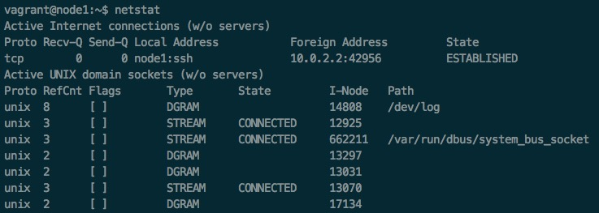

> 参考
> * [linw7的github](https://github.com/linw7/Skill-Tree/blob/master/Linux%E5%B7%A5%E5%85%B7.md)
> * 《鸟哥的Linux私房菜》

<br>

<!-- GFM-TOC -->
* [一.文件管理](#一文件管理)
    * [1.文件查找：find](#1文件查找find)
    * [2.文件拷贝：cp](#2文件拷贝cp)
    * [3.打包解包：tar](#3打包解包tar)
* [二.文本处理](#二文本处理)
    * [1.(显示行号)查看文件：nl](#1显示行号查看文件nl)
    * [2.文本查找：grep](#2文本查找grep)
    * [3.排序：sort](#3排序sort)
    * [4.转换：tr](#4转换tr)
    * [5.切分文本：cut](#5切分文本cut)
    * [6.拼接文本：paste](#6拼接文本paste)
    * [7.统计：wc](#7统计wc)
    * [8.数据处理：sed](#8数据处理sed)
    * [9.数据处理：awk](#9数据处理awk)
* [三.性能分析](#三性能分析)
    * [1.进程查询：ps](#1进程查询ps)
    * [2.进程监控：top](#2进程监控top)
    * [3.打开文件查询：lsof](#3打开文件查询lsof)
    * [4.内存使用量：free](#4内存使用量free)
* [四.网络工具](#四网络工具)
    * [1.网卡配置：ifconfig](#1网卡配置ifconfig)
    * [2.查看当前网络连接：netstat](#2查看当前网络连接netstat)
    * [3.查看路由表：route](#3查看路由表route)
    * [4.检查网络连通性：ping](#4检查网络连通性ping)
    * [5.转发路径：traceroute](#5转发路径traceroute)
    * [6.网络Debug分析：nc](#6网络debug分析nc)
    * [7.命令行抓包：tcpdump](#7命令行抓包tcpdump)
    * [8.域名解析工具：dig](#8域名解析工具dig)
    * [9.网络请求：curl](#9网络请求curl)
* [五.开发及调试](#五开发及调试)
    * [1.编辑器：vim](#1编辑器vim)
    * [2.编译器：gcc和g++](#2编译器gcc和g++)
    * [3.调试工具：gdb](#3调试工具gdb)
    * [4.查看依赖库：ldd](#4查看依赖库ldd)
    * [5.二进制文件分析：objdump](#5二进制文件分析objdump)
    * [6.ELF文件格式分析：readelf](#6elf文件格式分析readelf)
    * [7.跟踪进程中系统调用：strace](#7跟踪进程中系统调用strace)
    * [8.跟踪进程栈：pstack](#8跟踪进程栈pstack)
    * [9.进程内存映射：pmap](#9进程内存映射pmap)
* [六.其他](#六其他)
    * [1.终止进程：kill](#1终止进程kill)
    * [2.修改文件权限：chmod](#2修改文件权限chmod)
    * [3.创建链接：ln](#3创建链接ln)
    * [4.显示文件尾：tail](#4显示文件尾tail)
    * [5.版本控制：git](#5版本控制git)
    * [6.设置别名：alias](#6设置别名alias)
<!-- GFM-TOC -->


<br>

# 一.文件管理

## 1.文件查找：find

#### 使用方法

```bash
find [查找目录] [查找条件]

查找目录：
    .：在当前目录及子目录下查找（默认）
    A：在目录A及A的子目录下查找
查找条件：
    -name：根据文件名查找
    -regex：使用正则表达式匹配
    -type：按类型查找（f:文件，d:目录，l:链接...）
    -atime：按访问时间查找（n:n天前的一天内，+n:n天前(不含n天本身)，-n:n天内(不含n天)）
    -mtime：按修改时间查找（n:n天前的一天内，+n:n天前(不含n天本身)，-n:n天内(不含n天)）
    -size：按大小查找（单位k，+nk:"比nk更大"，-nk:"比nk更小"）
    -perm：按权限查找（644：权限等于644的文件）
    -user/-nouser：用户名等于/用户名不等于
    -group/-nogroup：组名等于/组名不等于
```

#### 示例

```bash
#1.在当前目录及子目录下查找后缀为cpp的文件
find . -name *.cpp

#2.使用正则表达式查找
find -regex ".*.cpp$"
```

## 2.文件拷贝：cp

#### 使用方法

```bash
cp [选项] 源路径 目的路径

选项：
    -a：将所有属性一起复制（包括拥有者、时间等信息）
    -i：目标文件存在时，进行询问
    -r：递归复制
```

## 3.打包解包：tar

#### 使用方法

```bash
tar [-j|-z] [cv] [-f 压缩包名] 目录
tar [-j|-z] [xv] [-f 解压包名] [-C 解压路径]

选项：
    -c/-x：打包/解包
    -j/-z：bzip2格式/gzip格式
    -v：显示过程
```

# 二.文本处理

## 1.(显示行号)查看文件：nl

行号计算不包括空行

## 2.文本查找：grep

#### 使用方法

```bash
grep [选项] 模式串 文件
输出 | grep [选项] 模式串

选项
    -e：使用多个模式串
    -i：忽略大小写
    -n：打印行号
    -c：统计次数（一行算一次）
```

#### 示例

```bash
#1.在test.c中搜索包含字符串”printf“或”count“的行
grep -e "printf" -e "count" test.c
```

## 3.排序：sort

#### 使用方法

```bash
sort [选项] 文件
输出 | sort [选项]

选项
    -d：按字典序排序（默认）
    -n：按数字排序
    -k："-k n"表示按各行第n列进行排序
    -r：反序
```

## 4.转换：tr

#### 使用方法

```bash
#set1、set2为字符集，可以是单个字符，也可以是字符串
输出 | tr [选项] set1 set2

选项：
    -d：删除字符
    -s：字符压缩
```

#### 示例

```bash
#1.删除字符':'
cat /etc/passwd | tr -d ':'

#2.将小写字母替换成大写字母
last | tr '[a-z]' 'A-Z'

#3.将'a'、'b'、'c'替换成'z'
cat test | tr “abc” 'z'

#4.将连续的'a'压缩成'b'（单个或连续出现的多个‘a’会压缩成一个‘b’）
cat test | tr -s 'a' 'b'
```

## 5.切分文本：cut

#### 使用方法

```bash
cut [选项] 文件
输出 | cut [选项]

选项：
    -d：分隔符（-d ':' 以’:‘为分隔符）
    -f：选择域（-f 1,2 输出分隔后第1列和第2列）
    -c：字符范围（-c n-m 输出第n到m个字符。如果没有m，输出到末尾）
```

#### 示例

```bash
#1.按’:‘分隔$PATH，输出第3个和第5个
echo $PATH | cut -d ':' -f 3,5

#2.输出export运行结果每行的第12-20个字符
export | cut -c 12-20
```

## 6.拼接文本：paste

#### 使用方法

```bash
paste [选项] file1 file2

选项：
    -d：指定拼接时使用的分隔符（默认使用tab作为分隔符）
```

## 7.统计：wc

#### 使用方法

```bash
wc [选项] 文件
输出 | wc [选项]

选项：
    -c：统计字符数
    -w：统计单词数
    -l：统计行数
```

## 8.数据处理：sed

>sed常用于一整行的处理。如果有一个100万行的文件，要在第100行加某些文字，此时由于文件太大，不适合用vim处理。因此使用sed是个很好的选择

#### 使用方法

```bash
sed [选项] '[动作]' 文件
输入 | sed [选项] '[动作]'

选项：
    -n：安静模式，只输出sed处理过的行（否则未处理行也会输出）
    -i：结果直接作用到文件（没指定时不会修改文件）
    -e：在命令行模式上输入动作
    -f：从文件中读取动作

动作：[n1[,n2]] function
function:
    a/i：在后插入/在前插入
    d：删除
    p：打印
    s：替换
```

#### 示例

```bash
#1.插入
nl /etc/passwd | sed '2a drink tea' #在第2行后插入一行："drink tea"
nl /etc/passwd | sed '2a aaa \
> bbb' #在第2行后插入两行："aaa"和"bbb"

#2.删除
nl /etc/passwd | sed '2,5d' #删除2~5行
sed '/^$/d' ip #将ip文件中的空行删除

#3.打印2~5行（安静模式，不使用安静模式2~5行会打印2次）
nl /etc/passwd | sed -n '2,5p'

#4.替换
nl /etc/passwd | sed '2s/daemon/root/g' #将第二行的daemon替换成root
ifconfig | grep 'inet addr' | sed 's/^.*addr://g' #将所有开头的“inet addr:”删除
```

## 9.数据处理：awk

>相比于sed常用于一整行的处理，awk则比较倾向于将一行分成数个“字段”来处理。因此，相当适合小型的数据处理

**awk处理步骤**：

1. 读入第一行，并将第一行的数据填入$0,$1,$2等变量当中
2. 依据条件类型的限制，判断是否需要进行后面的动作
3. 做完所有的动作与条件类型
4. 若还有后续的“行”的数据，则重复1~3步，直到所有的数据都读完为止

#### 使用方法

```bash
awk '条件类型1{动作1} 条件类型2{动作2} ...' filename
输出 | awk '条件类型1{动作1} 条件类型2{动作2} ...'

变量：
    $0：整行
    $1：按分隔符分隔后的第1列
    $2：按分隔符分隔后的第2列
    $k：按分隔符分隔后的第k列
    NF：每一行拥有的字段数
    NR：目前所处理的行数
    FS：目前的分隔字符（默认是空格或tab）
条件判断：>、<、>=、<=、==、!=
命令分隔：使用';'或Enter
```

#### 示例

```bash
#1.打印last -n 5结果中每行经过分隔符(默认情况下为空格或tab)分隔后的第1列和第3列
last -n 5 | awk '{print $1 "\t" $3}'

#2.以':'作为分隔符，打印第3列小于10的所有行的第1列和第3列
cat /etc/passwd | awk '{FS=":"} $3<10{print $1 "\t" $3}'      #（第一行不会处理）
cat /etc/passwd | awk 'BEGIN{FS=":"} $3<10{print $1 "\t" $3}' #（第一行会处理）

#3.假设test文件由3列数字组成，以空格分隔。该命令会计算每行的和然后打印
awk '{total=$1+$2+$3;printf "%10d %10d %10d %10.2f\n",$1,$2,$3,total}' test
```

注意上面的示例2，awk首先是读取一行，分隔后的数据填入$0,$1,$2等变量中才开始进行条件判断和执行动作。因此第一条命令在按空格或tab分隔后才将分隔符换成':'，所以第一行显示结果不对

# 三.性能分析

## 1.进程查询：ps

man ps手册非常庞大，不是很好查阅，因此主要记住几个命令

#### 示例

```bash
#1.列出仅与自身环境有关的进程，最上层的父进程是允许该ps命令的bash而没有扩展到init进程中去
ps -l

#2.列出系统所有进程的信息
ps aux
ps -ef    #aux会截断COMMAND列，-ef不会。aux是BSD风格，-ef是System V风格
ps axjf   #以"进程树"的方式显示所有进程
ps -lA    #输出格式同ps -l
```


* **F**：进程标志，说明进程的权限
    - 4：root权限
    - 1：仅能fork而不能exec
    - 0：既非4也非1
* **S**：进程的状态
    - R(running)：正在运行
    - S(Sleep)：可被唤醒的睡眠
    - D：不可被唤醒的睡眠（通常可能在等待I/O）
    - T：停止，可能是在后台暂停
    - Z(Zombie)：僵尸进程
* **C**：CPU使用率
* **PRI/NI**：Priority/Nice的缩写，CPU优先级(越小越高)
* **ADDR/SZ/WCHAN**：内存相关，ADDR指出进程在内存的哪个部分，running进程一般显示'-'。SZ为进程使用的内存。WCHAN表示进程当前是否运行中'-'，当进程睡眠时，指出进程等待的事件
* **TTY**：进程运行的终端机
* **TIME**：进程用掉的CPU时间


* **USER**：进程所属用户
* **%CPU/%MEM**：进程销毁的CPU百分比和内存百分比
* **VSZ**：进程用掉的虚拟内存(KB)
* **RSS**：进程占用的固定内存(KB)
* **TTY**：进程运行的终端机，与终端机无关则显示'?'。tty1~tty6是本机的登陆者程序，pts/0等表示由网络连接进主机的进程
* **STAT**：进程目前的状态，与```ps -l```结果中的**S**等同
* **START**：进程启动的时间
* **TIME**：进程实际使用的CPU运行时间

## 2.进程监控：top

#### 使用方法

```bash
top [选项]

选项：
    -d：跟秒数指定更新间隔
    -n：与-b搭配，指定需要进行几次top输出，重定向时常用
    -p：指定PID，监控特定进程
```

**top模式下的命令**：

* **?**：显示可用的命令
* **P**：以CPU使用情况排序
* **M**：以内存使用情况排序
* **N**：以PID排序
* **q**：退出
* **1**：多核情况下切换CPU

**%Cpu(s)后面的“wa”表示I/O wait，过高说明长时间等待I/O，I/O存在瓶颈**

## 3.打开文件查询：lsof

#### 使用方法

```bash
lsof [选项]

选项：
    -i：-i:端口号查看端口被占用的情况
    -u：后跟用户名查看具体用户打开的文件
    -p：后跟PID查看指定进程打开的文件
    +d：后跟目录查看指定目录下被进程打开的文件，"+D"递归
```

## 4.内存使用量：free

#### 使用方法

```bash
free [选项]

选项：
    -b|-k|-m|-g：单位
    -t：列出物理内存与swap的汇总情况    
```


* **buffers**：主要缓存dentry和inode等元数据
* **cached**：主要缓存文件内容，即page cache
* **- buffers/cache**：实际使用的内存。used-buffers-cached
* **+ buffers/cache**：可用内存。free+buffers+cached（在内存紧张时，buffers和cached可以回收）

[详细结果说明](https://fixatom.com/linux-free-cmd-buffers-and-cached/)

# 四.网络工具

## 1.网卡配置：ifconfig

## 2.查看当前网络连接：netstat

```bash
netstat [选项]

选项：
    -a：将所有的连接、监听、Socket数据都列出来（如，默认情况下，不会列出监听状态的连接）
    -t：列出tcp连接
    -u：列出udp连接
    -n：将连接的进程服务名称以端口号显示（如下图中Local Address会换成10.0.2.15:22）
    -l：列出处于监听状态的连接
    -p：添加一列，显示网络服务进程的PID（需要root权限）
    -i：显示网络接口列表，可以配合ifconfig一起分析
    -s：打印网络统计数据，包括某个协议下的收发包数量
```



* **Active Internet connections（w/o servers）：网络相关的连接**
    - **Recv-Q**：接收队列(已接收还未递交给应用)
    - **Send-Q**：发送队列(接收方未确认的数据)
    - **Local Address**：本地IP(主机):端口(服务名)
    - **Foreign Address**：远端IP:端口
    - >Recv-Q和Send-Q通常应该为0，如果长时间不为0可能存在问题
* **Active UNIX domain sockets（w/o servers）：本地相关的套接字**
    - **RefCnt**：连接到此socket的进程数
    - **Flags**：连接标识
    - **Type**：socket访问的类型
    - **Path**：连接到此socket的相关程序的路径

[netstat的10个基本用法](https://linux.cn/article-2434-1.html)

## 3.查看路由表：route

## 4.检查网络连通性：ping

## 5.转发路径：traceroute

## 6.网络Debug分析：nc

## 7.命令行抓包：tcpdump

#### 使用方法

```bash
sudo tcpdump [选项] ...

选项：
    -D/-i：查看/指定网卡
```

#### 示例

```bash
#抓取本地9877号端口的TCP数据包
sudo tcpdump -i lo tcp port 9877
```

下图为tcp回射服务器，客户端分别键入"hello"和“world”时，使用tcpdump抓取到的数据包

<div align="center">  </div>

## 8.域名解析工具：dig

## 9.网络请求：curl

# 五.开发及调试

## 1.编辑器：vim

## 2.编译器：gcc和g++

[C程序的编译过程](https://www.cnblogs.com/CarpenterLee/p/5994681.html)

#### 使用方法

```bash
gcc/g++ [选项] 源文件

选项：
    -E：让编译器在预处理之后停止，不进行后续编译过程，得到.i文件
    -S：让编译器在编译之后停止 ，不进行后续过程，得到.s文件
    -c：生成机器码即二进制.o文件
    -o：指定目标文件名
    -g：在编译的时候生成调试信息
    -Wall：生成所有警告信息
    -I 目录：指定头文件的查找目录
    生成动态链接库：
        1. gcc/g++ -c -fPIC 源文件 -o 目标文件名
        2. gcc -shared 目标文件名 -o 动态链接库名.so
    生成静态链接库：
        1. gcc/g++ -c 源文件 -o 目标文件名
        2. ar -crv 静态链接库名.a 目标文件名
    -l库名 -L 目录：引入链接库，-L指定查找该库的目录。如-lm表示引入libm.so
```

## 3.调试工具：gdb

#### 使用方法

```bash
#第一步：得到可执行文件
gcc/g++ -o 可执行文件 -g 源文件

#第二步：启动gdb
gdb #启动gdb

#第三步：执行gdb命令进行调试
(gdb) gdb命令

gdb命令：
    file 可执行文件：导入需要调试的文件
    r：运行程序
    q：退出gdb
    b：设置断点
        b 行号
        b 函数名称
        b *函数名
        b *代码地址
        b 编号
    c：继续执行，直到下一断点或程序结束
    s：执行一行代码，如果此行代码有函数调用则进入函数
    n：执行一行代码，如果此行代码有函数调用，不进入函数，直接执行函数
    i(info) 子命令：查看某些信息（只输入info或i可以查看有哪些子命令）
    list：查看源码
        list 行号：查看指定行号附近的源码
        list 函数：查看指定函数附近的源码
        list 文件:行号：查看指定文件中指定行附近的代码
    where：查看当前位置
    p(print) /格式 表达式
        格式：
            x：按十六进制格式显示变量
            d：按十进制格式显示变量
            u：按十六进制格式显示无符号整形
            o：按八进制格式显示变量
            t：按二进制格式显示变量
            a：按十六进制格式显示变量
            c：按字符格式显示变量
            f：按浮点数格式显示变量
        表达式中可用的操作符：
            @：一个和数组有关的操作符，左边是起始地址，右边是长度（p *arr@3）
            ::：指定一个在文件或是函数中的变量（p 'f2.c'::x）
            {<type>}<addr>：一个指向内存<addr>的类型为type的一个对象
    x(examine) <n/f/u> <addr>：查看内存
        n：正整数，表示需要显示的内存单元个数
        f：显示的格式（格式字母同上面的print）
        u：每个单元的字节数
            b：1字节
            h：2字节
            w：4字节（默认）
            g：8字节
```

## 4.查看依赖库：ldd

## 5.二进制文件分析：objdump

## 6.ELF文件格式分析：readelf

## 7.跟踪进程中系统调用：strace

## 8.跟踪进程栈：pstack

## 9.进程内存映射：pmap

# 六.其他

## 1.终止进程：kill

## 2.修改文件权限：chmod

* w权限不具有删除文件的能力
* 目录的x权限表示能否进入目录

#### 使用方法

```bash
chmod [选项] [u|g|o|a][+|-][r|w|x] 文件或目录
chmod [选项] 权限的数字表示 文件或目录

选项：
    -R：递归式的修改
```

## 3.创建链接：ln

## 4.显示文件尾：tail

## 5.版本控制：git

## 6.设置别名：alias
