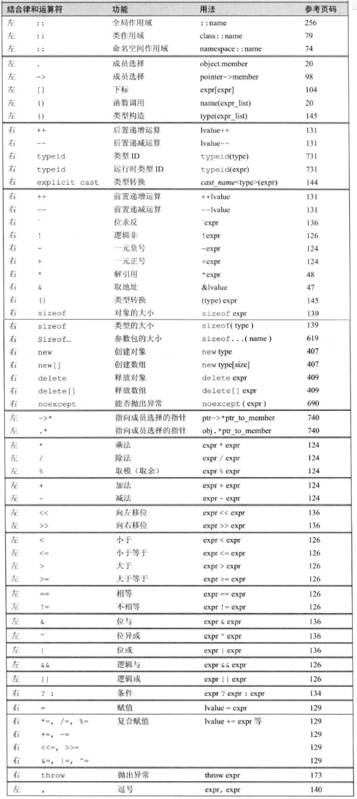

## 操作系统

* [《操作系统——精髓与设计原理》](操作系统/操作系统.md)

## 计算机网络

* [《计算机网络——自顶向下方法》](计算机网络/计算机网络.md)
* [《UNIX网络编程:卷1》](计算机网络/UNIX网络编程卷1.md)
* 《UNIX网络编程:卷1》——[头文件速查](计算机网络/接口与头文件.md)

## 数据结构与算法

* [1.查找](数据结构与算法/查找.md)
* [2.排序](数据结构与算法/排序.md)
* [3.二叉树](数据结构与算法/二叉树.md)
* [4.堆](数据结构与算法/堆.md)
* [5.平衡查找树](数据结构与算法/平衡查找树.md)
* [6.哈希表](数据结构与算法/哈希表.md)
* [7.图](数据结构与算法/图.md)
* [算法题列表](数据结构与算法/算法题列表.md)

> 参考:《数据结构与算法分析》(C++版) Clifford A. Shaffer

## Linux管理

* [Linux常用命令](Linux/Linux常用命令.md)

## C++

* [《深度探索C++对象模型》](C++/C++对象模型.md)

整形在16/32/64位平台下的大小：

<table>
<tr>
    <td rowspan="4" align="center"> <b>16位平台</b> </td>
    <td align="center"> char </td>
    <td align="center"> 1个字节(8位) </td>
</tr>
<tr>
    <td align="center"> short </td>
    <td align="center"> 2个字节(16位) </td>
</tr>
<tr>
    <td align="center"> <b>int</b> </td>
    <td align="center"> 2个字节(16位) </td>
</tr>
<tr>
    <td align="center"> long </td>
    <td align="center"> 4个字节(32位) </td>
</tr>
<tr>
    <td rowspan="5" align="center"> <b>32位平台</b> </td>
    <td align="center"> char </td>
    <td align="center"> 1个字节(8位) </td>
</tr>
<tr>
    <td align="center"> short </td>
    <td align="center"> 2个字节(16位) </td>
</tr>
<tr>
    <td align="center"> <b>int</b> </td>
    <td align="center"> 4个字节(32位) </td>
</tr>
<tr>
    <td align="center"> <b>long</b> </td>
    <td align="center"> 4个字节(32位) </td>
</tr>
<tr>
    <td align="center"> long long </td>
    <td align="center"> 8个字节(64位) </td>
</tr>
<tr>
    <td rowspan="5" align="center"> <b>64位平台</b> </td>
    <td align="center"> char </td>
    <td align="center"> 1个字节(8位) </td>
</tr>
<tr>
    <td align="center"> short </td>
    <td align="center"> 2个字节(16位) </td>
</tr>
<tr>
    <td align="center"> int </td>
    <td align="center"> 4个字节(32位) </td>
</tr>
<tr>
    <td align="center"> <b>long</b>> </td>
    <td align="center"> 8个字节(64位) </td>
</tr>
<tr>
    <td align="center"> long long </td>
    <td align="center"> 8个字节(64位) </td>
</tr>
</table>

C++运算符优先级表：

