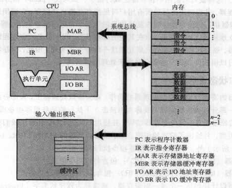

# 第一章.计算机系统概述

## 基本构成

计算机的四个主要组件

* 处理器
* 内存
* 输入/输入模块
* 系统总线

## 指令的执行

基本指令周期，指令处理包括2步：

* 处理器从存储器一次读一条指令
* 执行每条指令

处理器中的PC保存下一条指令的地址，IR保存当前即将执行的指令

## 中断

### 1.用途

提高CPU利用率，防止一个程序垄断CPU资源

### 2.类型

1）程序中断
2）时钟中断
3）I/O中断
4）硬件失效中断

### 3.中断控制流

I/O程序：

* 步骤4：为实际I/O作准备
* I/O命令：如果不使用中断，执行命令时，程序必须等待I/O设备执行请求的函数
* 步骤5：操作完成，包括设置成功或失败标签

中断：短I/O等待

* 用户程序可以与I/O命令的执行并发，只是在步骤4和步骤5中需要等待一小会

# 第二章.进程

# 第三章.线程

# 第四章.并发

# 第五章.内存管理

# 第六章.I/O管理与磁盘调度