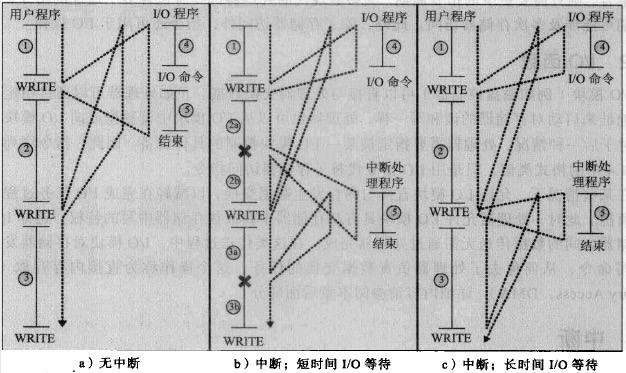
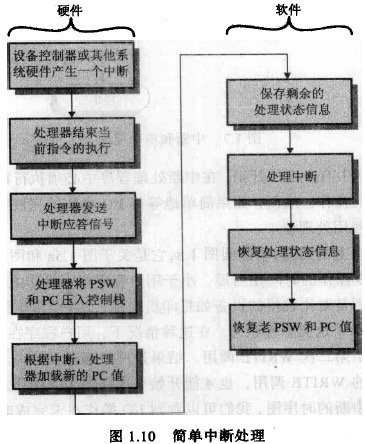
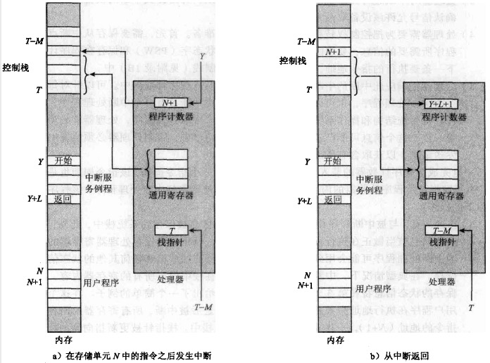

# 第一章.计算机系统概述

## 1.基本构成

计算机的四个主要组件

* 处理器
* 内存
* I/O模块
* 系统总线

## 2.指令的执行

基本指令周期，指令处理包括2步：

* 处理器从存储器一次读一条指令
* 执行每条指令

处理器中的PC保存下一条指令的地址，IR保存当前即将执行的指令

## 3.中断

### 3.1 目的

提高CPU利用率，防止一个程序垄断CPU资源

### 3.2 类型

1）程序中断
2）时钟中断
3）I/O中断
4）硬件失效中断

### 3.3 中断控制流

I/O程序：

* 指令序列4：为实际I/O作准备
* I/O命令：如果不使用中断，执行命令时，程序必须等待I/O设备执行请求的函数
* 指令序列5：操作完成，包括设置成功或失败标签

中断：短I/O等待

* 用户程序可以与I/O命令的执行并发，只是在指令序列4和指令序列5中需要等待一小会

中断：长I/O等待

* 对于如打印机等较慢的设备来说，I/O操作比执行一系列用户指令的时间长得多，因此在下一次I/O操作时，前一次I/O可能还为执行完。在上图c)中，第二次WRITE调用时，第一次WRITE的I/O还为执行完，结果是用户程序会在这挂起，当前面I/O完成后，才能继续新的WRITE调用

### 3.4 中断处理

中断激活了很多事件，包括处理器硬件中的事件及软件中的事件

被中断程序的信息保存与恢复：

### 3.5 多个中断

在处理一个中断的过程中，可能会发生另一个中断，处理多个中断有2种方法

* **当正在处理一个中断时，禁止再发生中断**：如果有新的中断请求信号，处理器不予理睬。通常在处理中断期间发生的中断会被挂起，当处理器再次允许中断时再处理
*  **定义中断优先级**：允许高优先级的中断处理打断低优先级的中断处理程序的允许

## 4.存储器的层次结构

从上往下看，会出现以下情况：
* 每“位”的价格递减
* 容量递增
* 存取时间递增
* 处理器访问存储器的频率递减（有效的基础是访问的局部性原理）

### 4.1 高速缓存

内存的存储周期跟不上处理器周期，因此，利用局部性原理在处理器和内存间提供一个容量小而速度快的存储器，称为高速缓存

上图中高速缓存通常分为多级：L1、L2、L3

## 5.直接内存存取(DMA)

针对I/O操作有3种可能的技术
* 可编程I/O（需处理器干预）
* 中断驱动I/O（需处理器干预）
* 直接内存存取

当处理器正在执行程序并遇到一个I/O相关的指令时，它通过给相应的I/O模块发命令来执行这个指令：

1）使用可编程I/O时，I/O模块执行请求的动作并设置I/O状态寄存器中相应的位，**但它并不进一步通知处理器，尤其是它并不中断处理器**，因此处理器在执行I/O指令后，还需定期检查I/O模块的状态，确定I/O操作是否完成。为了确定I/O模块是否做好了接收或发送更多数据的准备，处理器等待期间必须不断询问I/O模块的状态，这会严重降低整个系统的性能

2）如果是中断驱动I/O，在给I/O模块发送I/O命令后，处理器可以继续做其它事。当I/O模块准备好与处理器交换数据时，会中断处理器并请求服务，处理器接着响应中断，完成后再恢复以前的执行过程

尽管中断驱动I/O比可编程I/O更有效，但是**处理器仍需要主动干预在存储器和I/O模块直接的数据传送，并且任何数据传送都必须完全通过处理器**。由于需要处理器干预，这两种I/O存在下列缺陷：

* I/O传送速度受限于处理器测试设备和提供服务的速度（数据传送受限于处理器）
* 处理器忙于管理I/O传送工作，必须执行很多指令以完成I/O传送（处理器为数据传送需要做很多事）

3）因此，当需要移动大量数据时，需要使用一种更有效的技术：直接内存存取。DMA功能可以由系统总线中一个独立的模块完成，也可以并入到一个I/O模块中。

DMA的工作方式如下，当处理器需要读写一块数据时，它给DMA模块产生一条命令，发送下列信息：

* 是否请求一次读或写
* 涉及的I/O设备的地址
* 开始读或写的存储器单元
* 需要读或写的字数

之后处理器继续其它工作。处理器将这个操作委托给DMA模块，DMA模块直接与存储器交互，这个过程不需要处理器参与。当传送完成后，DMA模块发送一个中断信号给处理器。因此只有在开始和结束时，处理器才会参与

# 第二章.操作系统概述

## 1.操作系统的目标和功能

操作系统是控制应用程序执行的程序，并充当应用程序和计算机硬件之间的接口

* 作为用户/计算机接口
* 作为资源管理器（操作系统控制处理器使用其他系统资源，并控制其他程序的执行时机）
* 易扩展性

## 2.操作系统的发展

1. **串行处理**：程序员直接与计算机硬件打交道，因为当时还没操作系统。这些机器在一个控制台上运行，用机器代码编写的程序通过输入设备载入计算机。如果发生错误使得程序停止，错误原因由显示灯指示。如果程序正常完成，输出结果出现在打印机中
2. **简单批处理系统**：中心思想是使用一个称为监控程序的软件。通过使用这类操作系统，用户不再直接访问机器，相反，用户把卡片或磁带中的作业提交给计算机操作员，由他把这些作业按顺序组织成一批，并将整个批作业放在输入设备上，供监控程序使用。每个程序完成处理后返回到监控程序，同时，监控程序自动加载下一个程序
3. **多道批处理系统**：简单批处理系统提供了自动作业序列，但是处理器仍经常空闲，因为对于I/O指令，处理器必须等到其执行完才能继续。内存空间可以保持操作系统和一个用户程序，假设内存空间容得下操作系统和两个用户程序，那么当一个作业需要等到I/O时，处理器可以切换到另一个可能不需要等到I/O的作业。进一步还可以扩展存储器保存三个、四个或更多的程序，并且在他们之间进行切换。这种处理称为多道程序设计或多任务处理，是现代操作系统的主要方案
4. **分时系统**：正如多道程序设计允许处理器同时处理多个批作业一样，它还可以用于处理多个交互作业。对于后一种情况，由于多个用户分享处理器时间，因而该技术称为分时。在分时系统中，多个用户可以通过终端同时访问系统，由操作系统控制每个用户程序以很短的时间为单位交替执行

以下为多道批处理系统与分时系统的比较

||批处理多道程序设计|分时|
|:--:|:--:|:--:|
|主要目标|充分使用处理器|减小响应时间|
|操作系统指令源|作业控制语言；作业提供的命令|终端输入的命令|

## 3.现代操作系统

对操作系统要求上的变化速度之快不仅需要修改和增强现有的操作系统体系结构，而且需要有新的操作系统组织方法。在实验用和商用操作系统中有很多不同的方法和设计要素，大致分为以下几类：

* 微内核体系结构
* 多线程
* 对称多处理
* 分布式操作系统
* 面向对象设计

**大内核**：至今为止大多数操作系统都有一个单体内核，操作系统应该提供的大多数功能由这些大内核提供，包括调度、文件系统、网络、设备管理器、存储管理等。典型情况下，这个大内核是作为一个进程实现的，所有元素共享相同的地址空间

**微内核**：微内核体系结构只给内核分配一些最基本的功能，包括地址空间，进程间通信和基本的调度。其它操作系统服务都是由运行在用户态下且与其他应用程序类似的进程提供，这些进程可以根据特定应用和环境定制。这种方法把内核和服务程序的开发分离开，可以为特定的应用程序或环境要求定制服务程序。可以使系统结构的设计更简单、灵活，很适合于分布式环境

# 第三章.进程

# 第四章.线程

# 第五章.并发

# 第六章.内存管理

# 第七章.I/O管理与磁盘调度