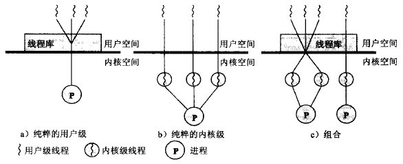

# 第一章.计算机系统概述

## 1.基本构成

计算机的四个主要组件

* 处理器
* 内存
* I/O模块
* 系统总线

## 2.指令的执行

基本指令周期，指令处理包括2步：

* 处理器从存储器一次读一条指令
* 执行每条指令

处理器中的PC保存下一条指令的地址，IR保存当前即将执行的指令

## 3.中断

### 3.1 目的

提高CPU利用率，防止一个程序垄断CPU资源

### 3.2 类型

1）程序中断
2）时钟中断
3）I/O中断
4）硬件失效中断

### 3.3 中断控制流

I/O程序：

* 指令序列4：为实际I/O作准备
* I/O命令：如果不使用中断，执行命令时，程序必须等待I/O设备执行请求的函数
* 指令序列5：操作完成，包括设置成功或失败标签

中断：短I/O等待

* 用户程序可以与I/O命令的执行并发，只是在指令序列4和指令序列5中需要等待一小会

中断：长I/O等待

* 对于如打印机等较慢的设备来说，I/O操作比执行一系列用户指令的时间长得多，因此在下一次I/O操作时，前一次I/O可能还为执行完。在上图c)中，第二次WRITE调用时，第一次WRITE的I/O还为执行完，结果是用户程序会在这挂起，当前面I/O完成后，才能继续新的WRITE调用

### 3.4 中断处理

中断激活了很多事件，包括处理器硬件中的事件及软件中的事件

被中断程序的信息保存与恢复：

### 3.5 多个中断

在处理一个中断的过程中，可能会发生另一个中断，处理多个中断有2种方法

* **当正在处理一个中断时，禁止再发生中断**：如果有新的中断请求信号，处理器不予理睬。通常在处理中断期间发生的中断会被挂起，当处理器再次允许中断时再处理
*  **定义中断优先级**：允许高优先级的中断处理打断低优先级的中断处理程序的允许

## 4.存储器的层次结构

从上往下看，会出现以下情况：
* 每“位”的价格递减
* 容量递增
* 存取时间递增
* 处理器访问存储器的频率递减（有效的基础是访问的局部性原理）

### 4.1 高速缓存

内存的存储周期跟不上处理器周期，因此，利用局部性原理在处理器和内存间提供一个容量小而速度快的存储器，称为高速缓存

上图中高速缓存通常分为多级：L1、L2、L3

## 5.直接内存存取(DMA)

针对I/O操作有3种可能的技术
* 可编程I/O（需处理器干预）
* 中断驱动I/O（需处理器干预）
* 直接内存存取

当处理器正在执行程序并遇到一个I/O相关的指令时，它通过给相应的I/O模块发命令来执行这个指令：

1）使用可编程I/O时，I/O模块执行请求的动作并设置I/O状态寄存器中相应的位，**但它并不进一步通知处理器，尤其是它并不中断处理器**，因此处理器在执行I/O指令后，还需定期检查I/O模块的状态，确定I/O操作是否完成。为了确定I/O模块是否做好了接收或发送更多数据的准备，处理器等待期间必须不断询问I/O模块的状态，这会严重降低整个系统的性能

2）如果是中断驱动I/O，在给I/O模块发送I/O命令后，处理器可以继续做其它事。当I/O模块准备好与处理器交换数据时，会中断处理器并请求服务，处理器接着响应中断，完成后再恢复以前的执行过程

尽管中断驱动I/O比可编程I/O更有效，但是**处理器仍需要主动干预在存储器和I/O模块直接的数据传送，并且任何数据传送都必须完全通过处理器**。由于需要处理器干预，这两种I/O存在下列缺陷：

* I/O传送速度受限于处理器测试设备和提供服务的速度（数据传送受限于处理器）
* 处理器忙于管理I/O传送工作，必须执行很多指令以完成I/O传送（处理器为数据传送需要做很多事）

3）因此，当需要移动大量数据时，需要使用一种更有效的技术：直接内存存取。DMA功能可以由系统总线中一个独立的模块完成，也可以并入到一个I/O模块中。

DMA的工作方式如下，当处理器需要读写一块数据时，它给DMA模块产生一条命令，发送下列信息：

* 是否请求一次读或写
* 涉及的I/O设备的地址
* 开始读或写的存储器单元
* 需要读或写的字数

之后处理器继续其它工作。处理器将这个操作委托给DMA模块，DMA模块直接与存储器交互，这个过程不需要处理器参与。当传送完成后，DMA模块发送一个中断信号给处理器。因此只有在开始和结束时，处理器才会参与

# 第二章.操作系统概述

## 1.操作系统的目标和功能

操作系统是控制应用程序执行的程序，并充当应用程序和计算机硬件之间的接口

* 作为用户/计算机接口
* 作为资源管理器（操作系统控制处理器使用其他系统资源，并控制其他程序的执行时机）
* 易扩展性

## 2.操作系统的发展

1. **串行处理**：程序员直接与计算机硬件打交道，因为当时还没操作系统。这些机器在一个控制台上运行，用机器代码编写的程序通过输入设备载入计算机。如果发生错误使得程序停止，错误原因由显示灯指示。如果程序正常完成，输出结果出现在打印机中
2. **简单批处理系统**：中心思想是使用一个称为监控程序的软件。通过使用这类操作系统，用户不再直接访问机器，相反，用户把卡片或磁带中的作业提交给计算机操作员，由他把这些作业按顺序组织成一批，并将整个批作业放在输入设备上，供监控程序使用。每个程序完成处理后返回到监控程序，同时，监控程序自动加载下一个程序
3. **多道批处理系统**：简单批处理系统提供了自动作业序列，但是处理器仍经常空闲，因为对于I/O指令，处理器必须等到其执行完才能继续。内存空间可以保持操作系统和一个用户程序，假设内存空间容得下操作系统和两个用户程序，那么当一个作业需要等到I/O时，处理器可以切换到另一个可能不需要等到I/O的作业。进一步还可以扩展存储器保存三个、四个或更多的程序，并且在他们之间进行切换。这种处理称为多道程序设计或多任务处理，是现代操作系统的主要方案
4. **分时系统**：正如多道程序设计允许处理器同时处理多个批作业一样，它还可以用于处理多个交互作业。对于后一种情况，由于多个用户分享处理器时间，因而该技术称为分时。在分时系统中，多个用户可以通过终端同时访问系统，由操作系统控制每个用户程序以很短的时间为单位交替执行

以下为多道批处理系统与分时系统的比较

||批处理多道程序设计|分时|
|:--:|:--:|:--:|
|主要目标|充分使用处理器|减小响应时间|
|操作系统指令源|作业控制语言；作业提供的命令|终端输入的命令|

## 3.现代操作系统

对操作系统要求上的变化速度之快不仅需要修改和增强现有的操作系统体系结构，而且需要有新的操作系统组织方法。在实验用和商用操作系统中有很多不同的方法和设计要素，大致分为以下几类：

* 微内核体系结构
* 多线程
* 对称多处理
* 分布式操作系统
* 面向对象设计

**大内核**：至今为止大多数操作系统都有一个单体内核，操作系统应该提供的大多数功能由这些大内核提供，包括调度、文件系统、网络、设备管理器、存储管理等。典型情况下，这个大内核是作为一个进程实现的，所有元素共享相同的地址空间

**微内核**：微内核体系结构只给内核分配一些最基本的功能，包括地址空间，进程间通信和基本的调度。其它操作系统服务都是由运行在用户态下且与其他应用程序类似的进程提供，这些进程可以根据特定应用和环境定制。这种方法把内核和服务程序的开发分离开，可以为特定的应用程序或环境要求定制服务程序。可以使系统结构的设计更简单、灵活，很适合于分布式环境

# 第三章.进程

## 1.进程的定义

进程有以下定义：

* 一个正在执行中的程序
* 一个正在计算机上执行的程序实例
* 能分配给处理器并由处理器执行的实体
* 一个具有以下特征的活动单元：一组指令序列的执行、一个当前状态和相关的系统资源集

也可以把进程视为由**程序代码、和代码相关联的数据集、进程控制块**组成的实体

**进程控制块**：由操作系统创建和管理。进程控制块包含了充分的信息，这样就可以中断一个进程的执行，并且在后来恢复执行进程时就好像进程未被中断过一样。进程控制块是操作系统能够支持多进程和提供多重处理技术的关键，**进程控制块是操作系统中最重要的数据结构，每个进程控制块包含操作系统所需要的关于进程的所有信息**

* 内存指针：包括程序代码和进程相关数据的指针，还有和其他进程共享内存块的指针
* 上下文数据：进程执行时处理器寄存器中的数据

进程被中断时，操作系统会把程序计数器和上下文数据保存到进程控制块中的相应位置

**程序状态字(PSW)**：所有处理器设计都包括一个或一组通常称为程序状态字的寄存器，包含有进程的状态信息

## 2.进程的状态

### 2.1 进程的创建与终止

进程按以下步骤创建：

1. 给新进程分配一个唯一的进程标识符
2. 给新进程分配空间（包括进程映像中的所有元素）
3. 初始化进程控制块
4. 设置正确的连接（保存到相应队列）

会导致创建进程的事件：

会导致终止进程的事件：

### 2.2 两状态进程模型

### 2.3 五状态进程模型

**运行态->就绪态**：1）超时：即正在运行的进程到达了”允许不中断执行“的最大时间段（所有多道程序操作系统都实行了这类时间限定）2）优先级低的进程被优先级高进程抢占（并不是所有操作系统都实行了）

图b)中一个事件对应一个队列。当事件发生时，相应队列中的所有进程都转换到就绪态

除此之外，就绪队列也可以按照优先级组织成多个队列

### 2.4 引入”挂起态“的进程模型

#### 为何引入？

考虑一个没有使用虚拟内存的系统，每个被执行的进程必须完全载入内存，因此，2.3图b)中，所有队列中的所有进程必须驻留在内存中

所有这些设计机制的原因都是由于I/O活动比计算速度慢得多，因此在单道程序系统中的处理器大多数时候是空闲的。但是2.3图b)的方案并未完全解决这个问题。在这种情况下，内存保存有多个进程，当一个进程正在等待时，处理器可以转移到另一个进程，但是处理器比I/O要快的多，以至于内存中所有的进程都在等待I/O的情况很常见。因此，即使是多道程序设计，大多数时候处理器仍然处于空闲

因此，**可以把内存中某个进程的一部分或全部移出到磁盘中**。当内存中没有处于就绪状态的进程时，操作系统就把被阻塞的进程换出到磁盘中的”挂起队列“。操作系统在此之后取出挂起队列中的另一个进程，或者接受一个新进程的请求，将其纳入内存运行

#### 进程模型

* **就绪/挂起->就绪**：1）内存中没有就绪态进程，需要调入一个进程继续执行；2）处于就绪/挂起的进程具有更高优先级
* **就绪->就绪/挂起**：1）如果释放空间以得到足够空间的唯一方法是挂起一个就绪态的进程；2）如果操作系统确信高优先级的阻塞态进程很快将会就绪，那么可能会挂起一个低优先级的就绪态进程而不是一个高优先级的阻塞态进程
* **新建->就绪/挂起**：进程创建需要为其分配内存空间，如果内存中没有足够的空间分配给新进程，会使用”新建->就绪/挂起“转换
* **阻塞/挂起->阻塞**：比较少见。如果一个进程终止，释放了一些内存空间，阻塞/挂起队列中有一个进程比就绪/挂起队列中任何进程的优先级都要高，并且操作系统有理由相信阻塞进程的事件很快就会发生
* **运行->就绪/挂起**：如果位于阻塞/挂起队列中的具有较高优先级的进程变得不再阻塞，操作系统抢占这个进程，也可以直接把这个进程转换到就绪/挂起队列中，并释放一些内存

#### 导致进程挂起的原因

## 3.进程的描述

操作系统为了管理进程和资源，必须掌握关于每个进程和资源当前状态的信息。普遍使用的方法是：操作系统构造并维护它所管理的每个实体的信息表：

内存表用于跟踪内(实)存和外存(虚拟内存)

使用**进程映像**来描述一个进程，进程镜像包括：**程序、数据、栈和进程控制块(属性的集合)**：

下图为一个典型的**进程映像**结构：

## 4.进程控制

### 4.1 执行模式

大多数处理器至少支持两种执行模式：

* **用户态**
* **内核态(系统态、控制态)**：软件具有对处理器及所有指令、寄存器和内存的控制能力

使用两种模式的原因是很显然的，它可以包含操作系统和重要的操作系统表(如进程控制块)不受用户程序的干涉

**处理器如何知道它正在什么模式下执行及如何改变模式？**

程序状态字(PSW)中有一位表示执行模式，这一位应某些事件的要求而改变。在典型情况下，

* 当用户调用一个操作系统服务或中断触发系统例程的执行时，执行模式被设置为内核态
* 当从系统服务返回到用户进程时，执行模式被设为用户态

### 4.2 进程切换

在下列事件中，进程可能把控制权交给操作系统：

* 系统中断：
    * **中断**：与当前正在运行的进程无关的某种类型的外部事件相关。控制首先转移给中断处理器，做一些基本的辅助工作后，转到与已经发生的特定类型的中断相关的操作系统例程
    * **陷进**：与当前正在运行的进程所产生的错误或异常条件相关。操作系统首先确定错误或异常条件是否是致命的。1）如果是，当前进程被换到退出态，发生进程转换；2）如果不是，动作取决于错误的种类或操作系统的设计，可能会进行一次进程切换或者继续执行当前进程
* 系统调用：转移到作为操作系统代码一部分的一个例程上执行。通常，使用系统调用会把用户进程置位阻塞态

进程切换步骤如下：
1. 保存处理器上下文环境（包括程序计数器和其它寄存器）
2. 更新当前处于运行态进程的进程控制块（状态和其它信息）
3. 将进程控制块移到相应队列
4. 选择另一个进程执行
5. 更新所选择进程的进程控制块（包括将状态变为运行态）
6. 更新内存管理的数据结构
7. 恢复处理器在被选择的进程最近一次切换出运行状态时的上下文环境

>**进程切换一定有模式切换；模式切换不一定有进程切换**（中断会发生模式切换，但是在大多数操作系统中，中断的发生并不是必须伴随着进程的切换的。可能是中断处理器执行之后，当前正在运行的程序继续执行）；

# 第四章.线程

## 1.进程与线程

* **进程**是操作系统进行资源分配的基本单位
* **线程**是调度的基本单位

进程中的所有线程共享该进程的状态和资源，进程和线程的关系如下图：

从性能上比较，线程具有如下优点：

1. 在一个已有进程中创建一个新线程比创建一个全新进程所需的时间要少许多
2. 终止一个线程比终止一个进程花费的时间少
3. 同一进程内线程间切换比进程间切换花费的时间少
4. 线程提高了不同的执行程序间通信的效率（在大多数操作系统中，独立进程间的通信需要内核的介入，以提供保护和通信所需要的机制。但是，由于在同一个进程中的线程共享内存和文件，它们无须调用内核就可以互相通信）

## 2.线程分类

线程的实现可以分为两大类：

* 用户级线程：有关线程管理的所有工作都由应用程序完成(使用线程库)，内核意识不到线程的存在
* 内核级线程：有关线程管理的所有工作都由内核完成，应用程序部分没有进行线程管理的代码

### 2.1 用户级线程

在用户级线程中，进程和线程的状态可能有如下转换：

* a)->b)：**线程2中执行的应用程序代码进行系统调用，阻塞了进程B**。例如，进行一次I/O调用。这导致控制转移到内核，内核启动I/O操作，把进程B置于阻塞状态，并切换到另一个进程。在此期间，根据线程库维护的数据结构，进程B的线程2仍处于运行状态。值得注意的是，从处理器上执行的角度看，线程2实际上并不处于运行态，但是在线程库看来，它处于运行态
* a)->c)：**时钟中断把控制传递给内核**，内核确定当前正在运行的进程B已经用完了它的时间片。内核把进程B置于就绪态并切换到另一个进程。同时，根据线程库维护的数据结构，进程B的线程2仍处于运行态
* a)->d)：**线程2运行到需要进程B的线程1执行某些动作的一个点**。此时，线程2进入阻塞态，而线程1从就绪态转换到运行态。进程自身保留在运行态

在前两种情况中，当内核把控制切换回进程B时，线程2会恢复执行

还需注意，**进程在执行线程库中的代码时可以被中断**，或者是由于它的时间片用完了，或者是由于被一个更高优先级的进程所抢占。因此在中断时，进程可能处于线程切换的中间时刻。当该进程被恢复时，线程库得以继续运行，并完成线程切换和把控制转移给另一个线程

#### 用户级线程的优点

1. 由于所有线程管理数据结构都在一个进程的用户地址空间中，线程切换不需要内核态特权，节省了两次状态转换的开销
2. 调度可以是应用程序相关的（一个应用程序可能更适合简单的轮转调度，另一个可能更适合基于优先级的调度），可以为应用量身定做调度算法而不扰乱底层操作系统调度程序
3. 可以在任何操作系统中运行，不需要对底层内核进行修改以支持用户级线程

#### 用户级线程的缺点

1. 当用户级线程执行一个系统调用时，不仅这个线程会被阻塞，进程中的所有线程都会被阻塞
2. 一个多线程应用程序不能利用多处理技术。内核一次只把一个进程分配给一个处理器，因此一次进程中只有一个线程可以执行（事实上，在一个进程内，相当于实现了应用程序级别的多道程序）

### 2.2 内核级线程

**内核能意识到线程的存在**

#### 内核级线程的优点

1. 内核可以同时把同一进程中的多个线程调度到多个处理器中同时运行
2. 如果进程中一个线程被阻塞，内核可以调度其它线程
3. 内核例程自身也可以使用多线程

#### 内核级线程的缺点

1. 把控制从一个线程转移到用一进程的另一线程时，需要到内核的状态切换

### 2.3 混合方案

可以混合使用用户级和内核级线程。在混合方案中，同一应用程序中的多个线程可以在多个处理器上并行地运行，某个会引起阻塞的系统调用不会阻塞整个进程。

如果设计正确，该方法将会结合纯粹用户级线程和内核级线程方法的优点，同时克服它们的缺点

# 第五章.并发

# 第六章.内存管理

# 第七章.虚拟内存

# 第八章.单处理器调度

# 第九章.I/O管理与磁盘调度

# 第十章.文件管理