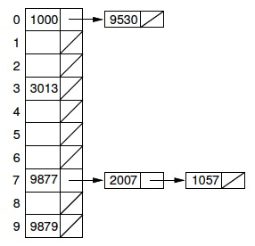
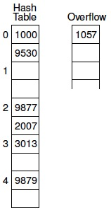
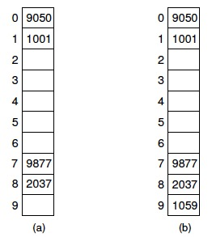

* [槽总数的选择](#槽总数的选择)
    - [关键码范围较小](#关键码范围较小)
    - [关键码范围较大](#关键码范围较大)
* [简单的哈希函数](#简单的哈希函数)
* [冲突解决策略](#冲突解决策略)
    * [开哈希(单链表)法](#开哈希(单链表)法)
    * [闭哈希(开放地址)法](#闭哈希(开放地址)法)

<br>
<br>

* **哈希**：把关键码值映射到表中的位置来访问记录的过程
* **哈希函数**：将关键码值映射到位置的函数
* **槽**：哈希表中的一个位置
* **冲突**：不同的关键码经过哈希函数哈希后，映射到相同槽的情况

哈希方法不适用于下列场景：

* 不适用于范围检索
* 不能找到具有最大或最小关键码值的记录
* 不能按关键码值的顺序访问记录

>哈希方法既适合基于内存的检索，也适合基于磁盘的检索。是组织存储在磁盘上的大型数据库的主要方法之一（另一种是B树）

## 槽总数的选择

### 关键码范围较小

由于关键码范围比较小，可以使用一个槽总数大于关键码总数的表。直接使用槽的下标作为关键码值，此时，不需要将关键码值作为记录的一部分进行存储。哈希函数可以直接设计成```h(K)=K```，但是这种情况比较少见

### 关键码范围较大

**如果可能的关键码范围较大，而同一时间段内存储的记录总数较少时。如果槽数的设计和前者匹配通常意味着空间的浪费，而如果和后者匹配又容易导致冲突，哈希设计的关键在于如何使用尽可能少的槽同时保证较低的冲突概率**

除此之外，如果对关键码值的分布特性不了解，也会使得哈希函数的设计更为困难。如果了解关键码值的分布特性，应对使用一个依赖于分布的散列函数，避免把一组相关的关键码值映射到表的同一个槽中（例如，如果对英文单词进行散列，就不应当对第一个字符的值散列，因为这样很可能使分布不均）

## 简单的哈希函数

**关键码为数值**的散列函数的设计：

* **取模**：哈希函数的返回值(槽的位置)只依赖于关键码的最低几位，由于这些位的分布可能很差，结果分布也就可能很差
* **平方取中**：一个很好的用于数值的散列函数。对于长度为2^r的表，取出平方后结果的中间r位作为槽的位置。由于关键码值的大多数位或者所有位都对结果有所贡献，所有效果很好

**关键码为字符串**的散列函数的设计：

* **所有字母ASCII值求和对M取模**

## 冲突解决策略

尽管散列函数的目标是使冲突最少，但实际上冲突是无法避免的。**冲突解决技术可以分为两类**：

1. **开哈希(单链表)法**
2. **闭哈希(开放地址)法**

### 开哈希(单链表)法

**闭哈希把冲突记录存储在表外**，一种简单的形式是把哈希表中的每个槽定义为一个链表的表头，哈希到一个槽的所有记录都放到该槽的链表内，每个链表可以按如下方式组织记录：



1. **按插入次序排序**：实现简单
2. **按关键码值次序排序**：一旦到达比要检索的关键码大的节点，说明不存在，就可以停止检索
3. **按访问频率次序排序**：访问较高的记录能快速检索到

>在磁盘中用一种很有效的方式存储一个开哈希表是很困难的，因为一个链表中的多个元素能存储在不同的磁盘块中。这就会导致检索一个关键码值需要多次磁盘访问，从而抵消了散列方法的好处

### 闭哈希(开放地址)法

**闭哈希把冲突记录存储在表中另一个槽内**。每条记录i有一个**基位置**，即由哈希函数计算出的槽。如果要插入一条记录R，而另一条记录已经占据了R的基位置，那么就把R存储在表中的其他槽内，由冲突解决策略决定应该是哪个槽。自然，检索时也要像插入一样，遵循同样的策略，以便重复进行冲突解决过程，找出在某位置没有找到的记录

#### 1）桶式哈希

* **插入**：将M个槽分成B个桶，每个桶中包含M/B个槽。哈希函数把每条记录分配到某个桶的第一个槽中。如果该槽被占用，就顺序地沿着桶查找，直到找到一个空槽。如果一个桶全部被占满，那么就把这条记录存储在表后具有无限容量的**溢出桶中**，所有桶共享一个溢出桶
* **检索**：确定桶，然后在桶中检索记录，如果没找到并且桶内有空槽，则检索结束。否则，检索溢出桶



>桶式哈希适用于实现基于磁盘的散列表，因为可以把桶的大小设置为磁盘块的大小。当检索时，就把整个桶读入内存。处理插入或检索操作只需进行一次磁盘访问，除非桶已经满了。如果桶满，需要从磁盘中检索溢出桶，自然应该使溢出很小，以最小化不必要的磁盘访问

#### 2）线性探查

**探查序列**：通过哈希函数计算出关键码的基位置，如果基位置发生冲突，根据**探查函数**去寻找下一个槽，直到找到一个空槽，这个过程产生的一组槽序列，就是探查序列

线性探查就是探查函数线性递增的冲突解决策略，如果基位置为30，整个探查序列会是30,31,32,33...



线性探查的问题在于，会产生**基本聚集**，基本聚集是指不同基位置的关键码产生的探查序列会发生重合，导致对剩余空槽的选择概率不均等
。产生的后果是会导致很长的探查序列

在上图a）中，如果使用线性探查，基位置为0,1,2的关键码在探查后都会选择序号为2的槽，同样，基位置为7,8,9的关键码在探查后都会选择序号为9的槽，这就使得剩余槽被选择的概率不相等。在图b）中，这个问题会更明显，如果下一个记录插入了序号为9的槽，则序号为2的空槽被插入记录的概率将是6/10

**基本聚集的解决方法**：

* **系数大于1的线性探查**(对线性探查函数添加常数C跳过一些槽)：比如当C为2时，基位置为1和2产生的探查序列为1,3,5..和2,4,6..这个方法对于不同关键码，将关键码值分成了几个集合，每个集合中的关键码只会探查所有槽中的一个部分
* **二次探查**：探查函数为i的平方，即基位置为30的关键码，产生的探查序列为30,31,34,39..这种方法的缺陷在于并不是哈希表中所有的槽都在探查序列中

上述方法虽然能解决基本聚集，但是对于基位置相同的关键码，产生的探查序列还是一样。如果哈希函数在某个基位置聚集，那么上面的方法仍然会保持聚集。也就是所谓的**二次聚集**。解决二次聚集可以使用**双哈希**

* **双哈希**：要使具有相同基位置的关键码产生不同的探查序列，那么探查函数也应该是基于关键码的函数。假设这个函数为h2(K)，一种方式是根据这个函数产生线性探查序列，即i\*h2(K)。例如，如果h2(K)=2，那么基位置为30的关键码产生的探查序列是：30，32，34...，由于h2是基于关键码值的函数，所以基位置相同的不同关键码会产生不同的探查序列，因此可以解决二次聚集