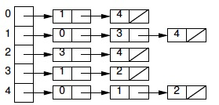
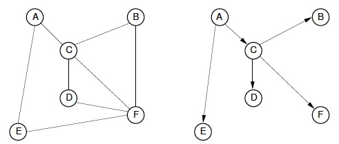

* [图的表示](#图的表示)
    - [邻接矩阵](#邻接矩阵)
    - [邻接表](#邻接表)
* [图的遍历](#图的遍历)
    * [DFS(深度优先遍历)](#DFS(深度优先遍历))
    * [BFS(广度优先遍历)](#BFS(广度优先遍历))
    * [拓扑排序](#拓扑排序)

 
 

**图可以用G=(V,E)来表示，每个图都包括一个顶点集合V和一个边集合E，顶点总数记为|V|，边总数记为|E|**

* **稀疏图**：边数较少的图
* **密集图**：边数较多的图
* **完全图**：包含所有可能边的图
* **带权图**：边上标有权的图
* **邻接点**：一条边所连的两个顶点
* **简单路径**：路径上不包含重复顶点的图
* **回路**：将某个顶点连接到本身，且长度大于等于3的路径
* **无环图**：不带回路的图

## 图的表示

图有两种常用的表示方法：

* **邻接矩阵**
* **邻接表**

### 邻接矩阵

使用一个二维矩阵来表示图:

* (i,j)=1，表示顶点i到顶点j之间有一条边**（非带权图）**
* (i,j)=n，表示顶点i到顶点j之间有一条权重为n的边**（带权图）**

**使用邻接矩阵的空间代价总是O(|V|^2)**

### 邻接表

邻接表使用一个顶点指针数组来表示：

* 数组的元素i表示顶点i的指针，它是一个链表的头结点
* 链表其余的顶点表示与顶点i之间存在边的顶点

**邻接表的空间代价与图中边的数目和顶点的数目均有关系。每个顶点要占据一个数组元素的位置，且每条边必须出现在其中某个顶点的边链表中**

## 图的遍历

### DFS(深度优先遍历)

DFS会递归地访问它的所有未被访问的相邻顶点。或者：

1. 先访问顶点v，把所有与v相关联的边存入栈中；
2. 弹出栈顶元素，栈顶元素代表的边所关联的另一个顶点就是要访问的下一个元素k；
3. 对k重复对v的操作；
4. 重复，直至栈中所有元素都被处理完毕

DFS的执行过程将产生一棵**DFS(深度优先搜索)树**：

整个DFS的过程如下：

### BFS(广度优先遍历)

使用一个队列。对于每个顶点，在访问其它顶点前，检查当前节点所有邻接点。和树的广度优先遍历类似

BFS执行过程将产生一棵**BFS(广度优先搜索)树**：

整个BFS的过程如下：

### 拓扑排序

**(DAG)有向无环图**可以描述这样一种场景：有一组任务，任务的执行顺序之间具有依赖性，一些任务必须在另一些任务完成之后才开始执行，如下图：

在这种场景下，任务之间的依赖关系不能出现环，否则任何一个都无法开始执行。**将一个(DAG)有向无环图中所有顶点在不违反先决条件规定的基础上排成线性序列的过程就是拓扑排序**