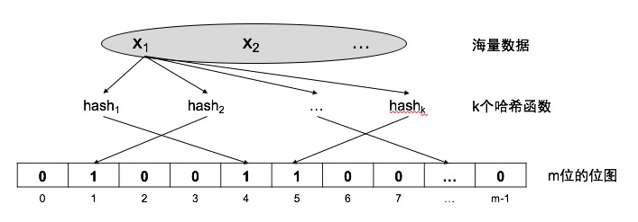

布隆过滤器可视为对位图的扩展

如果需要判断一个元素是否在一个集合中，位图的做法是申请一个N位（N为集合中最大整数）的数组，然后每一位对应一个特定整数

布隆过滤器的基本原理是位数组与Hash函数联合使用。具体而言，布隆过滤器是一个包含了m位的位数组，数组的每一位都初始化为0。然后定义k个不同的Hash函数，每个Hash函数都可以将集合中的元素映射到位数组中的某一位

**插入**：当向集合中插入一个元素时，根据k个Hash函数可以得到位数组中的k个位，将这些位全部设置为1

**查询**：当要查询某个元素是否属于集合时，就使用k个哈希函数得到此元素对应的k个位，如果所有点都是1，那么判断为元素在集合内（**注意，这种情况下只能说明元素可能在集合内，并不一定**），如果有0，则元素不在集合内（**因此，其实布隆过滤器的思想是“宁可误杀也不放过”，适用于黑名单网站的查询**）

插入元素时，对任意一个元素x，第i个哈希函数映射的位置hi(x)会被置为1（1<=i<=k）

> **布隆过滤器的位数m通常要比集合中的最大元素小的多，可见，布隆过滤器是一种空间效率和时间效率很高的随机数据结构，但这种高效是有一定代价**：在判断一个元素是否属于某个集合时，有可能会把不属于这个集合的元素误认为属于这个集合。因此，布隆过滤器不适合那些“零错误”应用场合，而在能容忍低错误率的应用场合下，布隆过滤器通过极少的错误换取了存储空间的极大节省