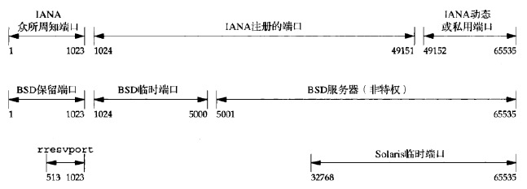
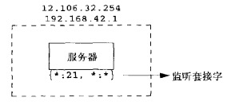
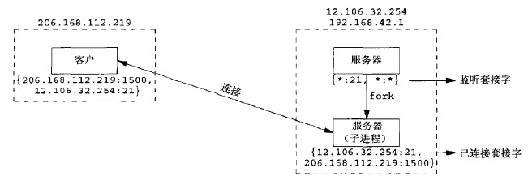
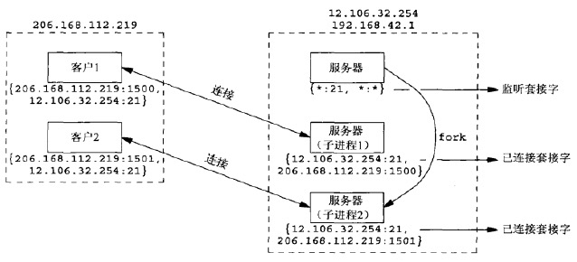

## 端口号

IANA(因特网已分配数值权威机构)维护着一个端口号分配状况的清单。该清单一度作为RFC多次发布；端口号被划分成3段：

* **众所周知的端口(0~1023)**：这些端口由IANA分配和控制。可能的话，相同端口号就分配给TCP、UDP和SCTP的同一给定服务。（如，不论TCP还是UDP端口号80都被赋予Web服务器，尽管它目前的所有实现都单纯的使用TCP）
* **已登记的端口(1024~49151)**：这些端口不受IANA控制，不过由IANA登记并提供它们的使用情况清单，以方便整个群体。可能的话，相同端口号也分配给TCP和UDP的同一给定服务。49151这个上限的引入是为了给临时端口留出范围
* **动态、私用的端口(49152~65535)**：IANA不管这些端口。就是我们所称的临时端口



## 套接字

一个**TCP套接字对**是一个定义该连接的两个端点的四元组

```
{本地IP,本地TCP端口号,外地IP,外地TCP端口号}
```

**套接字对唯一标识一个网络上的每个TCP连接**

标识每个端点的两个值（IP地址和端口号）通常称为一个套接字

## TCP并发服务器中的套接字对

1. **服务器端在21号端口监听，等待来自客户端的连接**



使用记号{\*:21,\*:\*}指出服务器的套接字对

* 第一个星号：服务器在任意本地接口的端口21上等待连接请求
* 第二个和第三个星号：等到任意IP，任意端口的连接

2. **主机206.168.112.219上的第一个客户发起一个连接，临时端口1500**：


3. **连接建立后，服务器fork一个子进程处理该客户的请求**：



4. **主机206.168.112.219上一个新的客户发起一个连接，服务器fork另一个子进程处理新客户的请求（由于临时端口不同，所有和前一个连接不是相同的连接）**：


