<!-- GFM-TOC -->
* [第一章.计算机网络和因特网](#第一章计算机网络和因特网)
    * [1.ISP(因特网服务提供商)](#1isp因特网服务提供商)
    * [2.时延](#2时延)
    * [3.协议层次和服务模型](#3协议层次和服务模型)
* [第二章.应用层](#第二章应用层)
    * [1.应用程序体系结构](#1应用程序体系结构)
    * [2.因特网提供的运输服务](#2因特网提供的运输服务)
    * [3.应用层协议](#3应用层协议)
        * [3.1 HTTP(超文本传输协议)](#31-http超文本传输协议)
        * [3.2 FTP(文件传输协议)](#32-ftp文件传输协议)
        * [3.3 电子邮件协议](#33-电子邮件协议)
        * [3.4 DNS(域名系统)](#34-dns域名系统)
        * [3.5 P2P应用](#35-p2p应用)
* [第三章.传输层](#第三章传输层)
    * [1.端口号与套接字](#1端口号与套接字)
        * [1.1 端口号](#11-端口号)
        * [1.2 套接字](#12-套接字)
    * [2.多路复用与多路分解](#2多路复用与多路分解)
    * [3.UDP](#3udp)
        * [3.1 UDP报文段结构](#31-udp报文段结构)
    * [4 可靠数据传输原理](#4-可靠数据传输原理)
        * [4.1 完全可靠信道上的可靠数据传输(rdt1.0)](#41-完全可靠信道上的可靠数据传输rdt10)
        * [4.2 具有比特差错信道上的可靠数据传输(rdt2.0、rdt2.1、rdt2.2)](#42-具有比特差错信道上的可靠数据传输rdt20rdt21rdt22)
        * [4.3 具有比特差错的丢包信道上的可靠数据传输(rdt3.0)](#43-具有比特差错的丢包信道上的可靠数据传输rdt30)
        * [4.4 流水线可靠数据传输](#44-流水线可靠数据传输)
    * [5.TCP](#5tcp)
        * [5.1 TCP报文段结构](#51-tcp报文段结构)
        * [5.2 流量控制](#52-流量控制)
        * [5.3 连接管理](#53-连接管理)
        * [5.4 拥塞控制](#54-拥塞控制)
* [第四章.网络层](#第四章网络层)
    * [1.网络层功能和服务](#1网络层功能和服务)
    * [2.转发](#2转发)
        * [2.1 路由器](#21-路由器)
    * [3.选路](#3选路)
        * [3.1 全局选路算法(LS算法)](#31-全局选路算法ls算法)
        * [3.2 分布式选路算法(距离向量算法)](#32-分布式选路算法距离向量算法)
        * [3.3 因特网中的选路](#33-因特网中的选路)
    * [4.IP(网际协议)](#4ip网际协议)
        * [4.1 因特网三大组件](#41-因特网三大组件)
        * [4.2 数据报格式](#42-数据报格式)
        * [4.3 IP数据报分片](#43-ip数据报分片)
        * [4.4 IPv4编址](#44-ipv4编址)
        * [4.5 DHCP(动态主机配置协议)](#45-dhcp动态主机配置协议)
        * [4.6 NAT(网络地址转换)](#46-nat网络地址转换)
        * [4.7 ICMP(互联网控制报文协议)](#47-icmp互联网控制报文协议)
        * [4.8 IPv6](#48-ipv6)
* [第五章.链路层和局域网](#第五章链路层和局域网)
    * [1.链路层提供的服务](#1链路层提供的服务)
        * [1.1 差错检测和纠错技术](#11-差错检测和纠错技术)
    * [2.媒体访问控制(MAC)协议](#2媒体访问控制mac协议)
        * [2.1 点对点协议(PPP)](#21-点对点协议ppp)
        * [2.2 多路访问协议](#22-多路访问协议)
    * [3.链路层编制](#3链路层编制)
        * [3.1 MAC地址](#31-mac地址)
        * [3.2 ARP(地址解析协议)](#32-arp地址解析协议)
    * [4.以太网](#4以太网)
        * [4.1 以太网帧结构](#41-以太网帧结构)
        * [4.2 链路层交换机](#42-链路层交换机)
<!-- GFM-TOC -->

 

||通信实体|通信结构|
|:--:|:--:|:--:|
|应用层|应用程序间|报文(message)|
|运输层|进程间|报文段(segment)|
|网络层|主机间|数据报(datagram)|
|链路层|链路节点间|帧(frame)|

* **MSS(最大报文段长)**：运输层报文段中“应用层数据”的最大大小，受限于MTU
* **MTU(最大传输单元)**：即最大链路层帧长，链路层所能传输的最大帧大小

# 第一章.计算机网络和因特网

端系统通过通信链路和分组交换机连接到一起，组成网络。网络和网络之间通过路由器相连，组成了因特网。因此，因特网是“网络的网络”

## 1.ISP(因特网服务提供商)

端系统通过ISP接入因特网。每个ISP是一个由多个分组交换机和多段通信链路组成的网络。不同的ISP为端系统提供了各种不同类型的网络接入

为了允许因特网用户之间互相通信，允许用户访问世界范围的因特网内容，这些低层ISP通过国家的、国际的高层ISP互联起来。高层ISP是由通过高速光纤链路互联的高速路由器组成。每个ISP都是独立管理的，运行IP协议，遵从一定的命名和地址习惯

* **第一层ISP(主干ISP)**
    * 覆盖国际区域（十几个）
    * 与其它低层次的ISP构成“客户-提供商”的关系
    * 不向任何人付费，可以向区域ISP和接入ISP出售因特网接入
* **(第一层外)的其它ISP**
    - 可以与两个或更多ISP连接，因此，即使它的ISP之一故障，它仍能继续发送和接收分组
    - 相同等级结构层次的邻近一对ISP能够对等，对等ISP不向其对等付费，对等ISP之间的流量直接连接
* **IXP(因特网交换点)**
    - 汇合点，多个ISP能够在此共同对等

## 2.时延

* **时延**
    - **处理时延**：检查分组首部，决定将分组导向何处所需的时延
    - **排队时延**：分组在链路上等待传输时，经受的排队时间
    - **传输时延**：将分组的所有比特推向链路所需的时间
    - **传播时延**：分组在链路中传播所需的时间

## 3.协议层次和服务模型

* **五层因特网协议栈**
    - **应用层**：任务是通过应用进程间的交互来完成特定网络应用
    - **运输层**：负责向两台主机中进程之间的通信提供数据传输服务
    - **网络层**：负责为分组交换网上的不同主机提供通信服务、选择合适的路由
    - **链路层**：将网络层的数据报封装成帧，使用链路层协议在相邻节点间的链路上传输帧
    - **物理层**：将帧中一个个比特从一个节点移动到下一个节点
* **七层OSI参考模型**
    - **表示层**：使通信的应用程序能够解释交换数据的含义，提供数据压缩、数据加密等服务
    - **会话层**：提供了数据交换的定界和同步功能，包括建立检查点和恢复方案的方法

# 第二章.应用层

## 1.应用程序体系结构

1. **客户机/服务器(C/S)体系结构**
2. **P2P体系结构**

## 2.因特网提供的运输服务

当创建一个新的因特网应用时，首先要做出的决定是选择UDP还是TCP，它们能为应用程序提供下列服务：

* **TCP**
    * 面向连接的服务
    * 可靠数据传输服务 
* **UDP**
    *  无连接的服务
    *  不可靠数据传输服务（不保证到达，也不保证有序到达）

除此之外，TCP具有拥塞控制机制，拥塞控制不一定能为应用程序带来直接好处，但能对整个网络带来好处。UDP没有拥塞控制

## 3.应用层协议

### 3.1 HTTP(超文本传输协议)

使用**TCP**作为运输层协议

**无状态协议**：服务器向客户机发送被请求的文件时，并不存储任何关于该客户机的状态信息。假如某个特定的客户机在短短的几秒钟内两次请求同一个对象，服务器并不会因为刚刚为该用户提供了该对象就不再做出反应，而是重新发送该对象

* HTTP客户机：web浏览器
* HTTP服务器：web服务器，包含web对象（HTML文件、JPEG文件、java小程序、视频片段等）

连接类型：

* **非持久连接**：每个请求/响应对是经一个单独的TCP连接发送
* **持久连接**：所有请求/响应对使用同一个TCP连接发送

**HTTP默认情况下使用持久连接**

如果使用非持久连接，将TCP握手第三步与一个HTTP请求报文结合起来发送，服务器接收请求后响应一个对象。因此，传输一个对象消耗2个RTT。（可以同时建立多个连接并行传输）但是，由于TCP连接会分配缓冲区和变量，大量使用非持久连接会给服务器造成压力

如果使用持久连接，则客户机接收到请求对象后服务器不会发送一个TCP连接关闭请求。这个连接服务于所有web对象的传输（流水线发送），如果经过一个时间间隔仍未被使用，则HTTP服务器关闭连接

#### 1）HTTP报文格式(请求报文)

“Host”：请求的目标主机  
“Connection:close”：浏览器告诉服务器不希望麻烦地使用持久连接，而是要求服务器在发送完请求后关闭连接  
“User-agent”：用户代理，即向服务器发送请求的浏览器的类型（服务器可以正确地为不同类型的用户代理发送相同对象的不同版本）  
“Accept-language”：用户想得到该对象的语法版本

**方法字段：**

* **GET**：绝大部分HTTP请求报文使用GET方法
* **POST**：用户提交表单时（如向搜索引擎提供关键字），但提交表单不一定要用POST方法
* **HEAD**：类似于GET，区别在于服务器返回的响应报文中不包含请求对象（常用于故障跟踪）
* **PUT**：用于向服务器上传对象
* **DELETE**：用于删除服务器上的对象

#### 2）HTTP报文格式(响应报文)

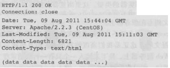

“Connection:close”：告诉客户机在报文发生完后关闭了TCP连接  
“Date”：报文生成、发生时的日期  
“Last-Modified”：web对象最后修改的日期  

**状态信息：**

* **200 OK**：请求成功，信息包含在返回的响应报文中
* **301 Moved Permanently**：请求的对象已经被永久转移了，新的URL定义在响应报文的Location首部中。客户机软件自动用新的URL获取对象
* **304 Not Modified**：条件GET的响应报文中的状态码，web服务器告诉web缓存相应对象未被修改
* **400 Bad Request**：请求不能被服务器理解
* **403 Forbidden**：服务器收到请求，但是拒绝提供服务。服务器通常会在响应报文中给出不提供服务的原因
* **404 Not Found**：被请求的文档不在服务器上
* **505 HTTP Version Not Supported**：服务器不支持请求报文使用的HTTP协议版本

>Telnet：HTTP响应报文查看工具

#### 3）cookie

**用于识别用户**，可能出于下列意图：

* 服务器想限制用户的访问
* 服务器想把内容与用户身份关联起来

cookie包含4个组成部分：

1. 在HTTP响应报文中有一个Set-cookie首部行
2. 在HTTP请求报文中有一个Cookie首部行
3. 在用户端系统中保留有一个cookie文件，由用户的浏览器管理
4. 在web站点有一个后端数据库

#### 4）web缓存

web缓存器也叫代理服务器，用于缓存web对象。用户可以配置其浏览器，使得所有HTTP请求首先指向web缓存器

如果web缓存器没有请求的对象，会与初始服务器直接建立一条TCP连接，web缓存器进一步发送HTTP请求，获取对象，当接收到对象后，首先在本地缓存，然后生成一个HTTP响应报文，发送给客户机（**因此，web缓存器既是客户机，又是服务器**）

web缓存器类似于内存与处理器之间的cache，它能从整体上大大降低因特网上的web流量，从而改善所有应用的性能

**条件GET**：web缓存器使用条件GET向web服务器确认某个对象是否已经被修改（不是最新的对象）。如果1)请求报文使用GET方法，2)并且包含一个If-modified-since:首部行，那么这个HTTP请求报文就是一个条件GET

如果相应对象未被修改，web服务器返回一个实体为空的响应报文(也就是说并没有包含请求对象)，状态码为“304 Not Modified”

### 3.2 FTP(文件传输协议)

FTP使用两个并行的TCP连接来传输文件：

1. **控制连接(持久)**：传输控制信息，如用户标识、口令、改变远程目录命令、文件获取上传的命令
2. **数据连接(非持久)**：传输实际文件

FTP客户机发起向FTP服务器的控制连接，然后在该连接上发送用户标识和口令、改变远程目录的命令。FTP服务器收到命令后，发起一个到客户机的数据连接，在该连接上准确地传送一个文件并关闭连接

**有状态的协议**：FTP服务器在整个会话期间保留用户的状态信息。服务器必须把特定的用户账号和控制连接联系起来

### 3.3 电子邮件协议

电子邮件系统有3个主要组成部分：**用户代理、邮件服务器、简单邮件传输协议(SMTP)**

* 每个用户在邮件服务器上有一个邮箱，保存该用户发送和接收的邮件
* 如果邮件未发送成功，会保存在邮件服务器上，通常30分钟左右再进行尝试，几天后仍不成功则删除，并以邮件形式通知发送方
* SMTP传输邮件之前，需要将报文主体编码为ASCII码，传输后需要解码（HTTP传输不需要）
* SMTP一般不使用中间邮件服务器发送邮件，即使两个邮件服务器位于地球的两端
* SMTP会把邮件中所有对象封装在一个报文中，而HTTP则是每个报文封装一个web对象

#### 1）多用途因特网邮件扩展(MIME)

普通的邮件报文主体为ASCII编码的数据，报文首部适合于发生普通的ASCII文本，但是不能充分满足多媒体报文或携带非ASCII文本格式(非英文字符)的报文需求。需要额外的首部行提供对发送这些文件的支持

MIME中包含2支持发送上述文件的首部：

* Content-Transfer-Encoding：指出所用编码类型，接收方可以根据这个字段还原
* Content-Type：文件类型，接收方可以根据这个首部采取一些适当动作（如解压）

#### 2）接收方邮件拉取

SMTP是一个”推协议“，不能用于接收方代理从邮件服务器上拉取邮件，拉取邮件需要使用**POP3(第三版的邮局协议)**、**IMAP(因特网邮件访问协议)**或**HTTP**

**POP3(第三版的邮局协议)**：当用户打开一个到邮件服务器端口110上的TCP连接后，POP3就开始工作了，包含3个阶段

* 特许：用户发送用户名和口令鉴别身份
* 事务处理：用户代理取回报文（还能标记报文、获取邮件统计信息）
* 更新：客户机发出了quit命令后，结束了POP3会话，邮件服务器会删除被标记为删除的报文

使用POP3拉取时，可以设置为”拉取并删除“或”拉取并保留“

**IMAP(因特网邮件访问协议)**：POP3不能提供远程文件夹功能，IMAP可以，IMAP服务器把每个报文与一个文件夹联系起来，IMAP为用户提供了创建文件夹以及在文件夹之间移动邮件的命令。除此之外，还提供在远程文件夹中查询邮件、按指定条件查询匹配文件的命令。与POP3不同，IMAP服务器维护了IMAP会话的用户状态信息

**基于web的电子邮件**：当使用web浏览器发送接收邮件时，推送到邮件服务器和从邮件服务器拉取邮件使用的是HTTP协议

### 3.4 DNS(域名系统)

DNS运行于**UDP**之上，使用**53号端口**，它提供下列服务：

1. **主机名到IP地址的转换(主要)**
2. **主机别名**：有着复杂主机名的主机可以拥有一个或多个别名，应用程序可以调用DNS来获得主机别名对应的规范主机名以及主机的IP地址
3. **邮件服务器别名**：qq.com与foxmail.com，DNS可以解析邮件服务器别名获得规范名和IP地址
4. **负载分配**：繁忙的站点被冗余分布在多台服务器上，这些服务器有不同IP地址，IP地址集合对应于一个规范主机名，当客户机通过主机名获取IP地址时，DNS服务器用包含全部这些地址的报文进行回答，但在每个回答中选择这些地址排放的顺序，从而将负载分配到不同服务器

#### 1）DNS服务器

集中设计(单一DNS服务器)具有下列问题：

* 单点故障
* 通信容量：单个DNS服务器承受所有查询负载
* 远距离的集中式数据库：单个DNS服务器不可能”邻近“所有查询客户机

所以DNS服务器使用分布式设计方案：

* **根DNS服务器**：因特网上有13个根DNS服务器(标号A到M)，大部分位于北美洲
* **顶级域(TLD)DNS服务器**
* **权威DNS服务器**

除此之外，DNS服务器还有**本地DNS服务器**。严格来说，本地DNS服务器不属于DNS服务器的层次结构，但对DNS层次结构很重要。**一台主机具有一台或多台本地DNS服务器的IP地址，本地DNS服务器起着代理的作用，将请求转发到DNS服务器层次结构中**

#### 2）DNS查询步骤

**DNS缓存**：在查询链中，当一个DNS服务器接收到一个DNS回答时，DNS服务器能将回答中的信息缓存在本地存储，以便加速后序可能的相同查询。由于主机IP和主机名之间的映射不是永久的，DNS服务器会在一段时间后丢弃缓存（本地DNS服务器可以缓存TLD服务器的IP地址，因为允许直接绕过查询链中的根DNS服务器）

#### 3）DNS记录和报文

所有DNS服务器共同存储着**资源记录**，资源记录格式如下：

**(Name,Value,Type,TTL)**

* **Type=A**：此时Name是主机名，Value是对应IP地址
* **Type=NS**：Name是域(如foo.com)，Value是知道如何获取该域中主机IP地址的权威DNS服务器的主机名
* **Type=CNAME**：Value是别名为Name的主机对应的规范主机名
* **Type=MX**：Value是别名为Name的邮件服务器的规范主机名

如果一台DNS服务器是某个特定主机名的权威DNS服务器，那么会有一条包含该主机名的类型A记录（不是权威服务器，也可能在缓存中包含A记录）  
如果DNS服务器不是某个主机名的权威DNS服务器，那么会包含一条类型NS记录，还将包含一条类型A记录，提供了在NS记录的Value字段中DNS服务器的IP地址

**DNS报文(查询和响应报文格式相同)**

>nslookup：从主机直接向某些DNS服务器发送DNS查询报文

**注册域名**

因特网名字和地址分配机构(ICANN)向各种注册登记机构授权，可以向这些机构申请注册域名：

1. 提供基本权威DNS服务器和辅助权威服务器的域名和IP
2. 注册登记机构会将NS和A类型的记录输入TLD服务器
3. 确保自身在提供的权威DNS服务器中输入了相应类型的记录

#### 4）DDos带宽洪泛攻击

如，攻击者向每个DNS根服务器连续不断地发送大量的分组，从而使得大多数合法的DNS请求得不到回答

DNS根服务器配置分组过滤器可以拦截这些分组，本地DNS服务器缓存了顶级域名服务器的IP地址，也能绕过DNS根服务器，防止攻击

### 3.5 P2P应用

不同于C/S架构，P2P架构中，每个主机即使客户机也是服务器，称作对等方，由于文件分布存储在多个对等方中，因此文件分发速度更快

**P2P中文件的搜索方式**

* **集中式索引**：使用一个集中式索引服务器存储索引，是一种P2P和C/S混合的体系结构，文件分发是P2P的，搜索是C/S的
* **查询洪泛**：建立在Gnutella协议基础上，索引全面分布在对等方区域中，对等方向相邻对等方发出文件查询请求，相邻对等方进一步转发查询请求
* **层次覆盖**：结合以上两种，与因特网高速连接并具有高可用性的对等方被指派为超级对等方，新的对等方与超级对等方之一建立TCP连接，将其可供共享的所有文件告诉超级对等方，超级对等方维护着一个索引，超级对等方之间通过TCP连接，可以转发查询

# 第三章.传输层

## 1.端口号与套接字

### 1.1 端口号

**通常在一台主机上能够运行许多网络应用程序。IP地址可以标识一台主机，端口号则是用来标识这台主机上的特定进程**

**端口号是一个16bit的数字，大小在0\~65535之间，0\~1023范围的端口号称为周知端口号，保留给周知的应用层协议**

|应用层协议|端口号|运输层协议|
|:--:|:--:|:--:|
|DNS|53|UDP|
|FTP|21(控制连接)，20(数据连接)|TCP|
|TELNET|23|TCP|
|DHCP|67(服务器)，68(客户端)|UDP|
|HTTP|80|TCP|
|HTTPS|443|TCP|
|SMTP|25|TCP|
|POP3|110|TCP|
|IMAP|143|TCP|

### 1.2 套接字

网络应用由成对进程组成，进程通过一个称为套接字的软件接口在网络上发生和接收报文

**套接字是同一台主机内应用层与运输层之间的接口，也可称为应用程序和网络之间的应用程序编程接口**

#### TCP套接字：(源IP,源端口,目的IP,目的端口)

#### UDP套接字：(目的IP,目的端口)

## 2.多路复用与多路分解

* **多路分解**：将运输层报文段中的数据交付到正确的套接字的过程（通过报文段的端口号字段）
* **多路复用**：从源主机不同套接字收集数据，并为数据封装上首部信息从而生成报文段，传递到网络的过程

## 3.UDP

出于下列原因可能使用UDP：

1. 应用层能更好地控制要发送的数据和发送时间（TCP拥塞时会遏制发送方发送）
2. 无需建立连接
3. 无连接状态（TCP需要维护连接状态，包括接收和发送缓存、拥塞控制参数、序号与确认号的参数）
4. 分组首部开销小（**每个TCP报文段有20字节的首部开销，而UDP仅有8字节的开销**）

可以在应用程序自身中构建可靠性机制来实现UDP应用的可靠数据传输

UDP能提供运输层最低限度的两个服务：**差错检测、数据交付**

### 3.1 UDP报文段结构

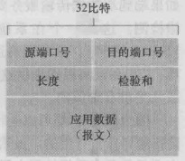

UDP首部只有4个字段，每个字段2个字节，一共8个字节大小的首部

**校验和**：对报文段中的所有16比特字的和相加（如有溢出会卷回，应该不包括校验和字段本身）的结果取反就是校验和。在接收方，会将所有16比特字的和相加，如果分组无差错，这个和会是“1111-1111-1111-1111”（为了方便阅读，使用'-'分隔）

许多链路层协议提供了差错检测，UDP还需提供校验和的原因在于，不能确保所有链路都提供了差错检测。此外，即使报文段经链路正确地传输，当其存储在某台路由器的内存中时，也可能引入比特差错。既未确保逐段链路的可靠性，也未确保内存中的差错检测，因此UDP必须在端到端基础上在运输层提供差错检测

## 4 可靠数据传输原理

* **rdt**：可靠数据传输
* **udt**：不可靠数据传输

### 4.1 完全可靠信道上的可靠数据传输(rdt1.0)

假设底层信道是完全可靠的

### 4.2 具有比特差错信道上的可靠数据传输(rdt2.0、rdt2.1、rdt2.2)

更现实的底层信道模型是分组中的比特可能受损

引入了**自动重传请求(ARQ)协议**，ARQ还需要另外3种协议来处理存在的比特差错：

1. **差错检测**
2. **接收方反馈**：肯定确认(ACK)和否定确认(NAK)
3. **重传**：接收方收到有差错的分组时，发送方重传

对于发送方，在等待ACK或NAK状态时，不能发送更多分组。类似于rdt2.0这种行为的协议被称为**停等协议**

**rdt2.0的问题在于没有考虑到ACK和NAK分组可能受损的情况**

处理受损ACK或NAK的办法是，如果收到受损的ACK或NAK，则重传一次分组，但是这样又无法确认是一次新的分组还是重传的分组。解决办法是在分组中添加一个序号字段，接收方只需检查序号即可确定收到的分组是否是一次重传。对于rdt2.0，只需1比特序号即可，从而得到rdt2.1

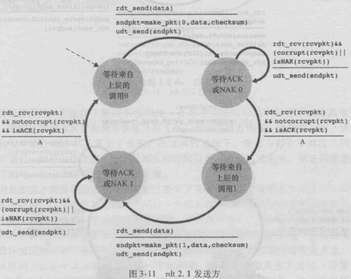
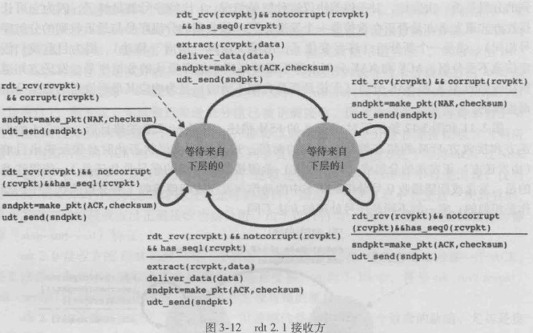

如果收到受损的分组，接收方也可以发送一个对上次正确接收分组的ACK，也能实现与NAK一样的效果，也就是rdt2.2

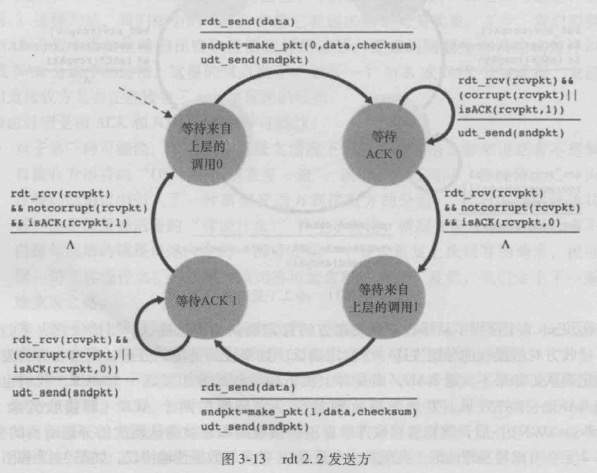
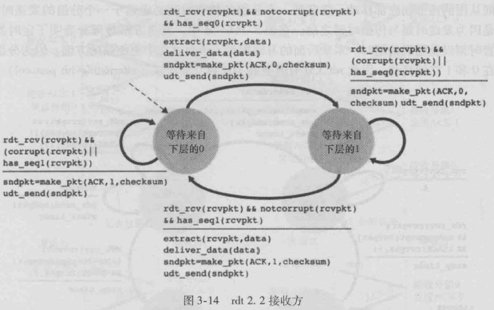

### 4.3 具有比特差错的丢包信道上的可靠数据传输(rdt3.0)

现在假定除了比特受损外，底层信道还会丢包，因此需要引入时间机制决定何时重传分组

### 4.4 流水线可靠数据传输

rdt3.0功能正确，但由于是一个停等协议，所以性能很差。如果能在收到确认之前发送多个分组，可以大大提升性能

#### 1）回退N步(GBN)

也被称为滑动窗口协议

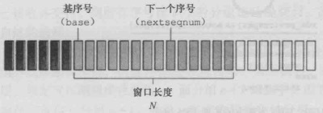

 * **发送方**
     - 超时重传所有已发送但未确认的分组
 * **接收方**
     - 每接收到一个有序分组交付到上层，丢弃无序分组
     - 累积确认收到的有序分组

**丢弃无序分组的优点在于接收方缓存简单，需要维护的唯一信息就是下一个按序接收的分组的序号；缺点是对于丢弃的分组，随后重传也许会丢失或出错，因此甚至需要更多的重传**

下图为窗口长度为4个分组的GBN运行情况：

#### 2）选择重传(SR)

一个单个分组的差错就可能引起GBN重传大量分组，许多分组根本没有必要重传。随着信道差错率的增加，流水线可能被这些没有必要重传的分组填满

* **发送方**
    - 如果收到的ACK对应一个窗口内的分组，则标记为已接收，序号等于send_base则移动窗口至具有最小序号的未确认分组处
    - 如果窗口移动了，并且有序号落在窗口内的未发生分组，则发送这些分组
* **接收方**
    - 确认(ACK)一个正确接收到的分组（收到滑动窗口前的分组也要再次确认，因为这种情况通常意味着这个分组的前一次确认未被发送方收到）
    - 失序分组会被缓存直到所有丢失分组都被收到，此时将一批分组按序交付给上层

一个SR运行的例子：

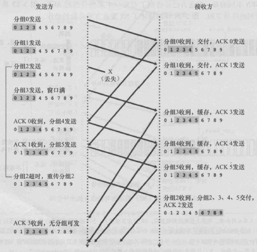

>对于SR而言，接收方窗口长度必须小于等于序号空间大小的一半，否则可能无法确认一个分组是重传还是初次传送

## 5.TCP

TCP是面向连接的，提供全双工的服务：数据流可以双向传输。也是点对点的，即在单个发送方与单个接收方之间的连接

### 5.1 TCP报文段结构

* **序号**：TCP的序号是数据流中的字节数，不是分组的序号。表示该报文段数据字段首字节的序号
* **确认号**：TCP使用累积确认，确认号是第一个未收到的字节序号，表示希望接收到的下一个字节
* **首部长度**：**通常选项字段为空，所以一般TCP首部的长度是20字节**
* (可选与变长的)**选项字段**：用于发送方与接收方协商MSS(最大报文段长)，或在高速网络环境下用作窗口调节因子
* **标志字段**
    - **ACK**：指示确认字段中的值是有效的
    - **RST,SYN,FIN**：连接建立与拆除
    - **PSH**：指示接收方应立即将数据交给上层
    - **URG**：报文段中存在着(被发送方的上层实体置位)“紧急”的数据
* **接收窗口**：用于流量控制（表示接收方还有多少可用的缓存空间）

TCP RFC并没有规定失序到达的分组应该如何处理，而是交给程序员。可以选择丢弃或保留

如果发生超时，TCP只重传第一个已发送而未确认的分组，超时时间间隔会设置为原来的2倍

### 5.2 流量控制

如果应用程序读取数据相当慢，而发送方发送数据太多、太快，会很容易使接收方的接收缓存溢出，流量控制就是用来进行发送速度和接收速度的匹配。发送方维护一个“接收窗口”变量，这个变量表示接收方当前可用的缓存空间

* LastByteRead:接收方应用程序从接收缓存中读取的最后一个字节
* LastByteRcvd:接收方接收到的最后一个字节

要防止缓存溢出，则应该满足如下条件：

LastByteRecv - LastByteRead <= RcvBuffer

接收方可通过下列公式计算RcvWindow:

RcvWindow = RcvBuffer - [LastByteRecv - LastByteRead]

然后将RcvWindow的值记录在TCP报文段中，发送给发送方。发送方轮流跟踪两个变量LastByteSent和LastByteAcked，这两个变量只差就是发送到连接中但未被确认的数据量。通过将其控制在RcvWindow内，就能实现流量控制:

LastByteSent - LastByteAcked <= RcvWindow

这个方案存在一个问题，当接收方缓存已满时，将RcvWindow=0通告给发送方，并且接收方没有任何数据要发送给发送方，随着接收方应用进程清空缓存，TCP并不向发送方发送带有RcvWindow新值的新报文段；TCP仅在它有数据或确认要发送时才会发送报文段。这样，发送方不会知道接收方缓存已经有新的空间，发送方因此被阻塞而不能再发送数据。为解决这个问题，TCP规约中要求：当接收方的接收窗口为0时，发送方继续发送只有1个字节数据的报文段。这些报文段将会被接收方确认。最终缓存将开始清空，并且确认报文里将包含一个非0的RcvWindow值

### 5.3 连接管理

#### 3次握手

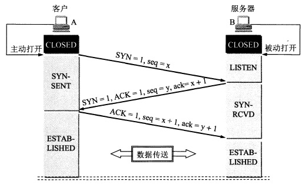

1. **客户端向服务器发送SYN报文段**（不包含应用层数据，首部的一个标志位(即SYN比特)被置位，客户端随机化选择(避免攻击)一个起始序号x）
2. 服务器为该TCP连接分配TCP缓存和变量，**返回一个SYNACK报文段**（也不包含应用层数据，SYN比特被置为1，ACK为x+1，服务器选择自己的初始序列y）
3. 客户机为该连接分配缓存和变量，**返回一个对SYNACK报文段进行确认的报文段**（因为连接已经建立了，所以SYN比特被置为0）

**如果客户端不发送ACK来完成第三次握手，最终(通常是一分钟后)服务器将终止该半开连接并回收已分配的资源（在第三次握手前分配缓存和变量，可能会受到SYN洪泛攻击）**

**前两次“握手”不包含有效载荷，第三次“握手”可以承载有效载荷**

> 需要3次握手的原因在于信道不可靠，如果信道可靠一方都能确保另外一方收到数据；
> * 为什么不是2次握手？ 如果只用2次握手，服务器收到客户端的请求后，因为服务器并不需要等待客户端的确认(第3次握手)，所以一个连接已经建立。1）在第2次握手时，如果报文段丢失，超时会引起客户端重新发起连接请求，此时服务器会认为这是客户端建立的另一个连接，因此又建立起一个连接，从而造成服务器为同一客户端维护了大量连接资源，造成浪费；2）如果客户端第一次握手超时，但是这个报文段并未丢失，直到一次正常的通信结束后才到达服务器。由于一次正常的通信后连接已经关闭，但是服务器认为这是客户端一次新的连接请求，因此建立起一个连接，但是客户端并不会对此进行响应，也造成了资源浪费；
> * 为什么不是4次握手？

#### 4次挥手

TCP连接的两个进程中任意一个都能终止该连接，连接关闭需要4步。假设客户端发起一个关闭请求：

1. **客户端发送一个FIN报文**（首部中的FIN比特被置位）
2. **服务器返回一个对FIN报文的确认报文**
3. **服务器发送一个FIN报文**（首部中的FIN比特被置位）
4. **客户端返回一个对FIN报文的确认报文**

>SYN洪泛攻击：攻击者发送大量的TCP SYN报文段，而不完成三次握手的第三步。通过从多个源发送SYN能够加大攻击力度，产生DDos(分布式拒绝服务) SYN洪泛攻击
预防：SYN cookies

>nmap：可以“侦察”打开的TCP接口、UDP接口；还能“侦察”防火墙及其配置；甚至能“侦察”应用程序及操作系统版本

### 5.4 拥塞控制

拥塞控制分类：

* 端到端拥塞控制：网络层没有为运输层拥塞控制提供显示支持（TCP的拥塞控制）
* 网络辅助的拥塞控制：网络层组件向发送方提供关于网络中拥塞状态的显式反馈信息（ATM ABR）
    - 直接反馈：路由器通过阻塞分组直接通知发送方拥塞
    - 路由器标记或更新从发送方流向接收方的分组中的某个字段来指示拥塞，接收方收到后通知发送方

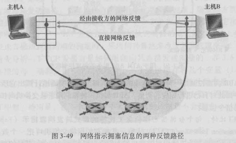

#### TCP拥塞控制

由于IP层不向端系统提供显示的网络拥塞反馈，所以TCP必须使用端到端拥塞控制，而不是网络辅助拥塞控制

**TCP连接的两方都记录一个额外的变量：拥塞窗口(CongWin)**，它对一个TCP发送方能向网络中发送流量的速率进行了限制。特别是，在一个发送方中未被确认的数据量不会超过CongWin与RcvWindow中的最小值:

LastByteSent - LastByteAcked <= min{CongWin,RcvWindow}

>后面的分析假设TCP接收缓存足够大，因此不受RcvWindow的限制，从而可以只关注拥塞窗口

**两个拥塞指示**：

* **3次冗余ACK**(第一次冗余是第二次收到相同ACK时，所以一共4次)
* **超时**

**TCP拥塞控制算法的三个主要部分**

1. **加性增、乘性减**
    * 加性增：缓慢增加CongWin，每个RTT增加1个MSS，线性增长（拥塞避免）
    * 乘性减：发生丢包是，设置CongWin = CongWin/2（不低于1个MSS），从而控制发送速度 
2. **慢启动**：TCP连接开始时，CongWin的初始值为1个MSS，指数型增长
3. **对拥塞指示作出反应**
    * 3次冗余ACK：CongWin = CongWin/2，然后线性增加（拥塞避免）
    * 超时：CongWin被设置为1个MSS，然后指数增长，直到CongWin达到超时前的一半为止

**Threshold(阈值)**：用于确定慢启动将结束并且拥塞避免将开始的窗口长度，初始化为一个很大的值，每当发送一个丢包时，会被设置为丢包时CongWin的一半

# 第四章.网络层

## 1.网络层功能和服务

网络层的3个重要功能

1. **转发**：当一个分组到达某路由器的一条输入链路时，路由器将分组移动到适当输出链路的过程
2. **选路**：当分组从发送方传至接收方时，网络层决定这些分组所采用的路由或路径的过程
3. **连接建立**：ATM等非因特网的网络层体系结构要求从源到目的地沿着所选的路径建立连接

**虚电路和数据报网络**

* **虚电路(VC)网络**：面向连接的，数据按需到达，分组不会丢失，路由器为进行中的连接维持连接状态信息
* **数据报网络**：无连接的，但在转发表中维持了转发状态信息。**因特网是数据报网络**（数据报网络中，通常每1\~5分钟左右更新一次转发表，因为转发表会被修改，所以从一个端系统到另一个端系统发送一系列分组可能在通过网络时走不同的路径，从而无序到达）

## 2.转发

使用**最长前缀匹配**来匹配路由表中的表项，决定转发出口

### 2.1 路由器

路由器由4部分组成：

* **输入端口**
* **交换结构**
* **输出端口**
* **选路处理器**：维护有选路信息与转发表，并执行路由器中的网络管理功能

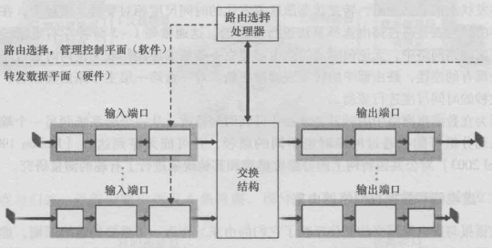

#### 1）输入端口

* **查找/转发模块**：对于路由器的转发功能是至关重要的。许多路由器中，都是在这确定一个到达的分组经交换结构转发到哪个输出端口。虽然转发表是由选路处理器计算的，但通常一份转发表的影子拷贝会被存放在每个输入端口，而且会被更新。因此，就可以在每个输入端口本地做出转发决策，而无需调用中央选路处理器，从而可以避免在路由器中的某个单点产生转发处理的瓶颈

#### 2）交换结构

一个分组可能会在进入交换结构时暂时阻塞，这是由于来自其它输入端口的分组正在使用该交换结构

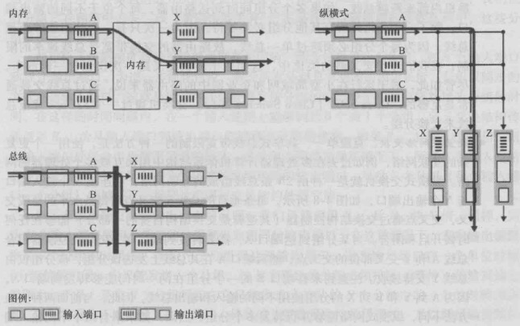

* **经内存交换**：分组到达输入端口时，端口会通过中断向选路处理器发出信号，于是分组被拷贝到处理器内存中。选路处理器则从分组首部中取出目的地址，在转发表中找出适当的输出端口，并将分组拷贝到输出端口的缓存中
* **经一根总线交换**：经一根共享总线将分组直接传送到输出端口，不需要选路处理器的干预。因为总线是共享的，故一次只能有一个分组通过总线传送
* **经一个互连网络交换**：到达某个输入端口的分组沿着连到输入端口的水平总线穿行，直至该水平总线与连到所希望的输出端口的垂直总线的交叉点

#### 3）输出端口

输出端口处理取出存放在输出端口内存中的分组并将其传输到输出链路上。当交换结构将分组交付给输出端口的速率超过输出链路速率时，就需要排队与缓存管理功能

#### 4）排队

输入端口和输出端口都能形成分组队列，随着队列的增长，路由器的缓存空间将会最终耗尽，出现**丢包**

**输出端口排队**：当所有输入端口的分组发往同一个输出端口并且交换结构速率足够大而输出端口的分组传输速率不高时，分组会在该输出端口排队。排队的后果是，输出端口上的一个分组调度程序必须在这些排队的分组中选一个来传送，分组调度程序在提供服务质量保证方面起着关键作用

**输入端口排队**：如果交换结构速率不高，不同输入端口的队首分组需要发往同一个输出端口，此时交换结构需要选择其中一个输入端口的分组进行发送。因此，其它输入端口中的分组会阻塞产生排队。在队首分组之后的分组，也会因为队首分组阻塞而被阻塞，即使它们需要转发到的输出端口此时处于空闲。这种现象叫做作**线路前部阻塞(HOL)**

## 3.选路

* **第一跳路由器 = 默认路由器 = 源路由器**
* **目的路由器：目的主机的默认路由器**

源主机到目的主机选路的问题可归结为从源路由器到目的路由器的选路问题

### 3.1 全局选路算法(LS算法)

全局选路算法用完整的、全局性的网络信息来计算从源到目的地之间的最低费用路径。由于具有全局状态信息，所以这种算法又常被称为**链路状态算法**

* **Dijkstra算法**（下图为一个处理过程）

### 3.2 分布式选路算法(距离向量算法)

以迭代的、分布式的方式计算出最低费用路径。和全局选路算法的区别在于，**没有节点拥有关于所有网络链路费用的完整信息，每个节点仅有与其直接相连链路的费用信息**

* **距离向量算法(DV)**
    - 分布式：每个节点从一个或多个直接相连的邻居接收某些信息，执行计算，然后将计算结果发回邻居
    - 迭代：上述过程持续到邻居之间没有更多的信息要交换为止
    - 异步：不要求所有节点相互之间步伐一致

DV使用公式：dx(y) = minv{c(x,y)+dv(y)} 更新x到y的距离（dx(y)是从x到y的最低费用路径的费用，minv是指取遍x的所有邻近）

下图展示了一个DV算法的执行过程：

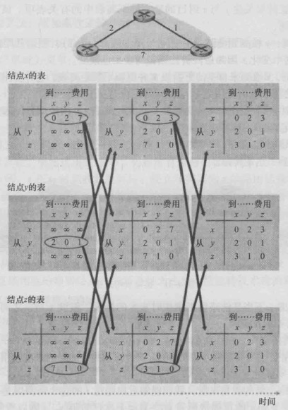

好消息传的快，坏消息传的慢：

* 好消息传的快
    - t0时：y检测到距x的费用由4变为1，更新其距离向量，并通知邻居
    - t1时：z收到来自y的更新报文并更新了其距离向量，计算出到x的新最低费用(5减为2)
    - t2时：y收到来自z的更新并更新其距离表，y的最低费用未改变，不发送报文，算法终止
* 坏消息传的慢
    - t0时：y更新其到x的距离为6(途经z，因为z的距离表中记录到x的距离为5)，这是分布式的角度，从全局角度看，这个距离是错的，但分布式中节点的状态信息有效。开始出现**选路环路**，即为到达x，y通过z选路，z又通过y选路，不停来回反复
    - t1时：y将到达x的新费用告知z
    - t2时：z收到y的消息，z计算出从x到x是50，从y到x是7，所以更新到x的最低费用为7，并通知y这个改变
    - 上述过程会一直反复，知道z最终算出它经由y的路径费用大于50为止（此时到x不途经y），y将经由z到x（如果费用增加到10000甚至更多，开销可想而知）

### 3.3 因特网中的选路

随着路由器数目变大，选路信息的计算、存储及通信的开销逐渐高得惊人，数亿台主机中存储选路信息需要巨大容量的内存。在公共因特网上所以路由器上广播LS更新的开销将导致没有剩余带宽供发送数据分组使用。距离向量算法在如此大的路由器中的迭代将肯定永远不会收敛。可以将路由器组织成自治系统(AS)来解决

**自治系统(AS)**：一组处于相同的管理与技术控制下的路由器集合（ISP个AS之间是什么关系？通常一个ISP中的路由器和互连它们的链路构成了单个AS，但许多ISP将它们的网络划分为多个AS）

因特网中的选路协议：

* **AS之间**
    - **边界网关协议(BGP/BGP4)**
        - 路由器对使用179端口的半永久TCP连接交换选路信息
        - 每条TCP连接的两台路由器被称为BGP对等方
        - 发送BGP报文的“TCP连接”称为BGP会话（跨越两个AS之间的BGP会话称为eBGP，同一AS中两个路由器间的BGP会话称为内部BGP会话）
        - BGP中，目的地是CIDR化的前缀，表示一个子网或子网集合（假设有多个子网与一个AS相连，AS会聚合这些前缀，来向相邻的AS通告聚合后的单一前缀，如果到达相同前缀有多个路由，BGP会使用一些规则消除直到留下一条路由）
* **AS内部**
    - **开发最短路径优先(OSPF)**
        - 直接承载在IP分组中，必须自己实现可靠报文传输、链路状态广播等功能
        - 使用LS选路算法，链路费用是由网络管理员配置的
        - 通常用于较顶层的ISP中，而RIP通常用于较低层的ISP中
        - 至少每隔30分钟广播一次链路状态(即使状态未发生改变)
    - **选路信息协议(RIP)**
        - 运行于UDP之上的应用层协议
        - 使用DV选路算法，使用跳数作为费用测度，“跳”是从源路由器到目的子网的子网数，一条路径的最大费用被限制为15，从而限制了使用RIP的AS规模。
        - 大约每30秒通过RIP响应报文(也称为RIP通告)交换距离向量信息

## 4.IP(网际协议)

### 4.1 因特网三大组件

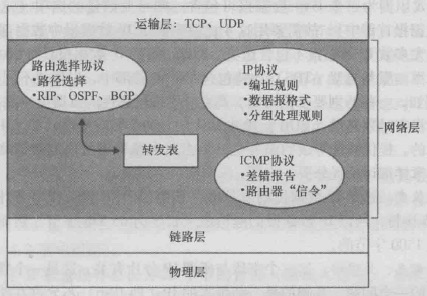

1. **IP协议**
2. **选路组件**
3. **报告数据报中的差错和对某些网络层信息请求进行响应的设施**

### 4.2 数据报格式

下图为一个IPv4数据报的格式：

* **版本号**：IP协议的版本，路由器根据版本号确定如何解释剩余部分
* **首部长度**：一个IPV4数据报可包含一些可选项，所以需要用4比特确定数据部分实际从哪开始，**大多数IP数据报不包含可选项，有20字节的首部**
* **服务类型**：可以使不同类型(实时与非实时等)的IP数据报区分开来
* **数据报长度**：IP数据报的总长（**首部+数据**）
* **寿命(TTL)**：用以确保数据报不会永远在网络中循环，每经过一台路由器减1，减为0时丢弃
* **上层协议**：指明了数据部分应该交给哪个运输层协议（UDP(6)、TCP(17)）
* **首部校验和**：首部中每2个字节作为一个数，和的反码存入校验和字段中。路由器一般会丢弃检测出的错误数据报。每台路由器上都必须重新计算并更新校验和，因为TTL及选项字段可能会改变
* **选项**：在IPv6中已不再使用

除此之外，首部中的以下3个字段用于IP数据报分片的标识

* **标识**：识别分片的序号
* **标志**：最后一个分片的标志为0，其余分片的标志为1
* **比特片偏移**：该分片起始数据在原数据报中的偏移量/8

### 4.3 IP数据报分片

一个链路层帧能承载的最大数据量叫做**最大传输单元(MTU)（以太网可承载不超过1500字节的数据）**，因为每个IP数据报封装在链路层帧中，再从一台路由器运输到下一台路由器，故链路层协议MTU严格地限制着IP数据报的长度。发送方与目的地路径上的每段链路可能使用不同的链路层协议，每种协议可能具有不同的MTU，如果转发表查找决定的出链路的MTU比该IP数据报的长度小，则需要对IP数据报进行分片  
片在到达目的地运输层以前需要被组装，如果一个或多个片没有到达目的地，则该不完整的数据报被丢弃

分片可以通过4.2中介绍的IP数据报中的标识、标志、比特片偏移来识别

### 4.4 IPv4编址

主机与物理链路之间的边界叫做接口，一个IP地址在技术上是与一个接口相关联的，而不是与包括该接口的主机或路由器相关联的

IP地址编址格式：**点分十进制**，一个接口的IP地址的组成部分需要由其连接的子网来决定。互连主机的接口与路由器一个接口的网络形成一个**子网**：

IP编址为子网分配一个地址：223.1.1.0/24，其中/24记法称为**子网掩码**。其它要连到223.1.1.0/24网络的主机都要求其地址形式为223.1.1.xxx

上图对应了下图中3个子网：

除此之外，子网还包括互连路由器接口的网段

#### 1）分类编制

在无类别域间选路之前，IP地址的分配策略采用分类编制，网络分为下面3类

* A类网络：网络部分被限制长度为8比特
* B类网络：网络部分被限制长度为16比特
* C类网络：网络部分被限制长度为24比特

**分类编制的问题在于：对于一个组织，分配一个B类网络可能太大，分配一个C类网络可能太小，这样分配B类网络就会造成地址空间的迅速消耗，以及大量的地址浪费。这个问题类似于操作系统内存管理中固定分区的问题**

#### 2）无类别域间选路(CIDR)

32比特的IP地址被划分为2部分，a.b.c.d/x，前x比特构成了IP地址的网络部分，被称为该地址的网络前缀

组织外部的路由器仅考虑前缀比特，大大减少了路由器中的转发表的长度。剩余32-x比特用于区分组织内部设备，当组织内部的路由器转发分组时，才会考虑这些比特

>IP地址由因特网名字与号码分配机构(ICANN)管理，非盈利的ICANN不仅分配IP地址，还管理DNS根服务器、解决分配域名与域名纠纷，ICANN向地区性因特网注册机构分配地址，这些机构一起形成了ICANN地址支持组织，处理本地域内的地址分配/管理

### 4.5 DHCP(动态主机配置协议)

一个组织一旦获得一块地址，就可以为该组织内的主机和路由器接口分配独立的IP地址

DHCP可以提供以下服务：

* 为主机分配IP地址
* 获取子网掩码
* 获取第一跳路由器地址（常称为默认网关）
* 提供本地DNS服务器的地址（记录在/etc/resolv.conf文件中）

由于DHCP具有能将主机连接进一个网络的自动化网络相关方面的能力，故它又常被称为**即插即用协议**

每个子网拥有一台DHCP服务器，如果某个子网没有DHCP服务器，则需要一个知道用于该网络的一台DHCP服务器地址的DHCP中继代理（通常是一台路由器）

**DHCP协议的4个步骤：**

1. **DHCP服务器发现**：新到的客户端在67号端口使用UDP广播(255.255.255.255)**DHCP发现报文**，源地址为0.0.0.0
2. **DHCP服务器提供**：子网中收到DHCP请求报文的DHCP服务器使用**DHCP提供报文**作出响应，提供IP地址、网络掩码、IP地址租用期(通常设置为几个小时或几天)
3. **DHCP请求**：客户端从多个服务器的响应中选择一个，并用一个**DHCP请求报文**对选中的服务器进行响应，回显配置参数
4. **DHCP ACK**：服务器用**DHCP ACK报文**对DHCP请求报文进行响应，证实所要求的参数

>DHCP有不足之处：每当一个节点连到一个新子网时，都要从DHCP得到一个新的IP地址，这样当一个移动节点在子网直接移动时，就不能维持与远程应用之间的连接。移动IP是一种对IP基础设施的扩展，允许移动节点在子网之间移动时能使用其单一永久的地址

### 4.6 NAT(网络地址转换)

NAT适用这样一种场景：由于每个IP使能的设备都需要一个IP地址，如果一个子网已经获得了一块IP地址，当连入设备增加时，IP地址可能不足

NAT主要通过**NAT使能路由器**来解决上述问题。同时，地址空间10.0.0.0/8是在RFC 1918中保留的3部分IP地址空间之一，可以用于专用网络或具有专用地址的地域（具有专用地址的地域是指其地址仅对该网络中的设备有意义的网络），关键问题是：专用地址对于外部网络无效，使用专用地址的设备如何与外部网络通信？为了解决这个问题，NAT使能路由器中保存有一个NAT转换表：

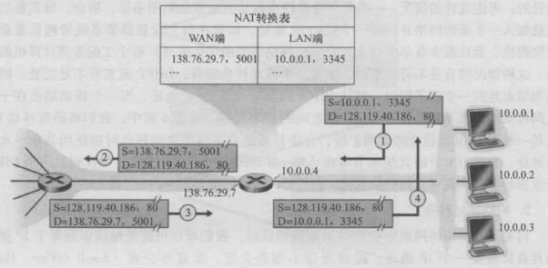

NAT使能路由器对外界的行为就像一个具有单一IP地址的单一设备，通过端口号来标识一个使用专用地址的设备

* 当专用设备与外界通信时，NAT使能路由器为其生成一个新的源端口号，并使用连入广域网一侧接口的IP地址作为源地址发送数据报，同时会将这个映射关系记录在NAT转换表中
* 当有数据报到达时，NAT使能路由器通过查找NAT转换表中的映射关系，改写目的IP和端口号，向专用网络转发数据报

>NAT有很多争议：1）端口号是用于编址进程的方法，不是用于编址主机的；2）路由器应该处理最多达第三层的分组；3）NAT违反了所谓的“端到端原则”；4）解决IP地址短缺的方法应该是IPv6，而不是像NAT这样一种权宜之计；但是不管喜欢与否，NAT已成为因特网一个重要的组件

### 4.7 ICMP(互联网控制报文协议)

ICMP用于主机和路由器彼此交互网络层信息。最典型的用途是差错报告，但其用途不仅限于此(如源抑制，用于拥塞控制)

ICPM通常被认为是IP的一部分，但从体系结构上讲，它是位于IP之上，因为ICMP报文承载在IP分组中，作为IP有效载荷

ICMP的类型和编码：

>Traceroute：允许用户跟踪从一台主机到世界上任意一台其他主机之间的路由，使用ICMP报文实现。发送一系列不可达UDP端口号的UDP报文段，每个报文段封装后的数据报TTL字段逐1递增，TTL为n的数据报到达第n跳路由器时，由于TTL过期，路由器会生成ICMP报文响应，由此可以获得第n跳路由器的IP和名字，当一个数据报最终到达目的主机时，由于UDP端口不可达，目的主机生成一个ICMP报文，指示此错误信息，从而获得Traceroute也知道不需要再发送探测分组了，因此获得了到达目的主机的所有路由数量、标识以及RTT

### 4.8 IPv6

#### 1）IPv6数据报格式

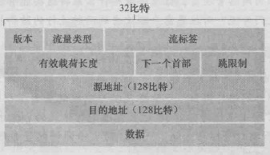

IPv6引入了称为**任播地址**的新地址，这种地址可以使一个数据报能交付给一组主机中的任意一个

定长的40字节首部允许更快的处理IP数据报

* **版本号**：IPv6将该字段值设置为6
* **流量类型**：与IPv4中的”服务类型“字段含义相同，区分不同类型数据报（实时/非实时）
* **有效载荷**：数据部分的字节数
* **下一个首部**：应该交付给运输层的哪个协议
* **跳限制**：同TTL

**IPv6不允许在中间路由器上进行分片与重新组装，这种操作只能在源于目的地上进行**。如果一台路由器收到的IPv6数据报因太大而不能转发到出链路上，则只需丢掉该数据报，并返回一个”分组太大“的ICMP差错报文。因此IPv6中没有IPv4用于分片相关的3个字段

IPv6的关注快速处理分组，由于运输层提供了差错检测，IP设计者可能觉得没必要再在网络层进行差错检测，所以去掉了首部校验和字段

IPv4中的选项字段并没有作为IPv6的首部字段出现，但其并未消失，而是可能出现在可能出现在首部中由”下一个首部“指出的位置上

#### 2）从IPv4向IPv6迁移

虽然能处理IPv6的系统可做成向后兼容的，即能发送和接收IPv4数据报，但已设置的IPv4使能的系统不能处理IPv6数据报，要解决这个问题可以使用双栈（即IPv6节点也具有完整的IPv4实现，这样的节点在RFC 4213中被称为IPv6/IPv4节点）

一种双栈方法是**建隧道**：

假定2个IPv6节点要使用IPv6通信，但经由IPv4路由器而互连，将中间IPv4路由器的集合称为一个隧道  
借助于隧道，在该隧道发送端的IPv6节点可将整个IPv6数据报放在一个IPv4数据报的数据字段中。于是该IPv4数据报地址设为指向隧道接收端的IPv6节点（同时具有IPv6和IPv4地址），然后通过隧道传输  
隧道接收端的IPv6节点最终收到该IPv4数据报，并确定IPv4数据报含有一个IPv6数据报，提取出后再为IPv6数据报选路，转发

# 第五章.链路层和局域网

## 1.链路层提供的服务

链路层可能提供的服务包括：

* **成帧**：将网络数据报封装成帧
* **链路接入**：媒体访问控制(MAC)协议规定了帧在链路上传输的规则
* **可靠交付**：可靠交付服务通常用于易产生高差错率的链路，对于低比特差错的链路，可靠交付可能被认为是一种不必要的开销，因此不提供此服务
* **流量控制**：没有流量控制，可能会造成缓存区溢出
* **差错检测**
* **差错纠正**
* **半双工和全双工**：全双工时，链路两端的节点可以同时传输分组

### 1.1 差错检测和纠错技术

在发送节点，为了避免比特差错，使用**差错检测和纠错比特(EDC)**来增强数据D

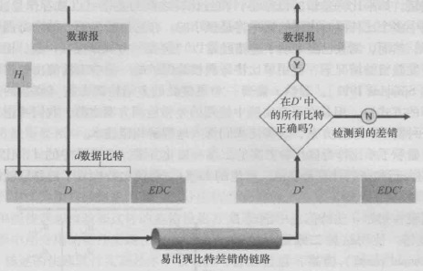

差错检测和纠正技术有时使接收方检测到已经出现的比特差错，但并非总是这样。即使采用差错检测比特，也还是可能有未检出比特差错的情况  
因此，主要是选择一个差错检测方案，使得这种事件发生的概率很小。可以使用下列3种技术进行差错检测：

1. **奇偶校验**：只需包含1个附加比特。
    * 对于**偶校验**，选择一个值使得所有比特中1出现偶数次
    * 对于**奇校验**，选择一个值使得所有比特中1出现基数次
    接收方通过检测1出现的次数判断是否出现差错。如果出现偶数个比特差错，则检验不出。可以使用二维化的方案（详见教材）进行优化
2. **校验和**：通常更多的应用于运输层。将数据分为多个k比特的序列，相加(可能回滚)后取反，作为校验和。接收方对所有k比特（包括校验和）的序列相加，结果的任意比特如果出现0，则检测为出现比特差错
3. **循环冗余检测(CRC)**：发送方和接收方协商一个r+1比特的生成多项式(G)，要起其最高比特位为1。发送方通过在d比特的数据后附加r比特，使得整个(d+r)比特的值能够被G整除。接收方用G去除(d+r)比特，如果余数非0，则出现差错（附加r比特的计算详见教材）

## 2.媒体访问控制(MAC)协议

### 2.1 点对点协议(PPP)

点对点协议(PPP)用于**点对点链路**，点对点链路由链路一端的单个发送方和链路另一端的单个接收方组成。通常住宅主机拨号链路就是用的PPP，所以它是目前部署最广泛的链路层协议之一

### 2.2 多路访问协议

多路访问协议用于**广播链路**，广播链路能够让多个发送和接收节点都连接到相同的、单一的、共享的广播信道上。多路访问协议用于协调多个发送和接收节点对一个共享广播信道的访问

1. **信道划分协议**
    * **TDM(时分多路复用)**：对于N个节点的信道，传输速率为R bps，TDM将时间划分为时间帧，并进一步划分每个时间帧为N个时隙，每个节点在特定的时隙内传输（消除了碰撞，非常公平；但节点被限制与R/N bps的平均速率，即使只有一个节点有数据要发送）
    * **FDM(频分多路复用)**：在R bps的信道中创建了N个较小的R/N bps信道，每个节点使用一个较小的信道传输（消除了碰撞，公平；但节点被限制与R/N bps的平均速率，即使只有一个节点有数据要发送）
    * **CDMA(码分多址)**：每个节点分配一种不同的编码，每个节点使用其唯一的编码来对发送的数据进行编码（如果精心选择编码，不同节点能同时传输）
2. **随机接入协议**
    * **纯ALOHA**：帧到达节点时，立刻传输。如果发生碰撞，节点将立即(在完全传输碰撞帧后)以概率p重传。否则，等待一个帧传输时间，再以概率p重传...（信道有效传输速率实际不是R bps，而是时隙ALOHA的一半，详见教材）
    * **时隙ALOHA**：时间被划分为时隙，每个节点的时间同步，帧的传输只在时隙的开始时进行。如果发生碰撞，在下一个时隙开始时以概率p重传，否则等待一个时隙再以概率p重传...（信道有效传输速率实际不是R bps，而是0.37R bps，详见教材）
    * **CSMA(载波侦听多路访问)**：发送前先侦听信道，如果没有其它节点在使用信道，则传输数据。CSMA没有碰撞检测，即使发生碰撞，也将传输完碰撞帧（由于节点间数据传输存在时延，很可能一个传输正在信道中但是由于还未到达所以检测到信道空闲，此时传输最终会发生碰撞）
    * **CSMA/CD(具有碰撞检测的载波侦听多路访问)**：先侦听信道，如果没有其它节点在使用信道，则传输数据。但是有碰撞检测，如果发生碰撞，会停止传输剩下的数据，等待一个随机时间(通常比传输一帧短)后，再进行尝试
3. **轮流协议**
    * **轮询协议**：指定节点之一为主节点。主节点以循环的方式轮询每个节点。告诉每个节点能够传输的最大帧数，然后让节点传输帧，主节点通过观察信道上是否缺乏信号来决定一个节点合适完成了帧的发送（消除了困扰随机接入协议的碰撞和空时隙，效率很高；但引入了轮询延时，同时主节点发生故障将使信道不可用）
    * **令牌传递协议**：节点间通过令牌传递信道使用权，如果没有数据发送，立即传递令牌给下一节点（一个节点的故障可能会使整个信道崩溃。或者如果一个节点忘记释放令牌，必须调用某些恢复步骤使令牌返回到循环中来）

## 3.链路层编制

### 3.1 MAC地址

长度为**6字节，共48比特**，通常用**十六进制表示法**，地址的每个字节被表示为一对十六进制数

* **每个适配器具有一个唯一的MAC地址，不随位置发生变化**（就像人的身份证，而IP则像人的邮政地址）
* **一台路由器的每个接口都有一个ARP模块和一个适配器**

**MAC地址分配**：当一个公司要生产适配器时，它支付象征性的费用购买一块MAC地址空间，IEEE分配这块地址时，固定前24比特，让公司自己为每个适配器生成后24比特的唯一组合

### 3.2 ARP(地址解析协议)

**提供将IP地址转换为链路层地址的机制**（ARP只为同一子网上的节点解析IP地址，DNS为因特网中任何地方的主机解析主机名）：
1. 每个节点的ARP模块都在它的RAM中有一个ARP表，包含IP地址到MAC地址的映射关系，每个表项还包含TTL字段，表示表项过期时间（ARP表示自动创建的，如果某节点与子网断开连接，它的表项最终会从留在子网中的节点的表中删除。通常一个表项的过期时间是20分钟）
2. 主机向其ARP模块提供一个IP地址，ARP模块返回IP地址对应的MAC地址

**如果相应表项尚未存在ARP表中**？
1. 查询节点构造**ARP查询分组**，包含有查询节点和目的节点的IP地址，适配器在链路层帧中封装这个ARP分组广播帧
2. 子网中的所有其他适配器接收到帧，将帧中的ARP分组向上传递给ARP模块，每个节点检查自身IP是否与ARP分组中的目的地址相同，相同的返回一个**ARP响应分组**​​​​​​
3. 查询节点接收到ARP分组，获得目的MAC地址，并更新自身的ARP表

**发送数据报到子网以外**？

假设主机1要向主机2发送数据报，应该使用什么MAC地址？如果使用49-BD-D2-C7-56-2A作为目的MAC地址，由于子网内任何一个适配器的MAC地址都不匹配，所以这个数据报将会死亡。正确的步骤如下：

1. 主机1通过ARP获取路由器接口111.111.111.110的MAC地址，将数据报封装成帧，转发
2. 路由器的接口111.111.111.110受到帧，由于MAC地址匹配，适配器获取帧中的数据报上传给网络层
3. 路由器通过查找转发表将数据报通过交换结构转发到输出接口222.222.222.220
4. 输出接口222.222.222.220通过ARP获取子网中主机2的MAC地址
5. 获得主机2的MAC地址后，将数据报传递给适配器，封装成帧，最终发送到主机2

## 4.以太网

虽然20世纪80年代和90年代早期，以太网面临着其他LAN技术包括令牌环、FDDI、ATM的挑战，但是至今，以太网仍是最流行的有线局域网技术

所有的以太网技术都向网络层提供**无连接服务**、**不可靠服务**

### 4.1 以太网帧结构

* **前同步码**：8字节。以太网帧以一个8字节的前同步码字段开始。前7个字节的值都是10101010，最后一个字节是10101011。前7个字节用于“唤醒”接收适配器，并且将其时钟与发送方的时钟同步，第8个字节的最后两个1告诉接收适配器，“重要的内容”就要来了，因此接收适配器知道接下来的6个字节是目的地址
* **类型**：网络层协议类型
* **数据**：46\~1500字节。承载了IP数据报，以太网的最大传输单元(MTU)是1500字节，IP数据报最小46字节，如果不够会填充（如果填充，在目的端填充也会上传到网络层，通过数据报首部的长度字段去除填充）
* **循环冗余检测(CRC)**：提供差错检测与纠正，具体见1.1。如果校验成果，并不会发送肯定确认。如果校验失败，也不会发生否定确认，只是丢弃该帧

### 4.2 链路层交换机

现代以太网LAN使用了一种星型拓扑，每个节点与中心交换机相连

* 交换机的任务是接收入链路层帧并将它们转发到出链路
* 交换机自身对节点透明：某节点向另一节点寻址一个帧，顺利地将该帧发送进LAN，而不知道这个帧经过了某个交换机的接收与转发

**交换机具有如下性质**：

* **消除碰撞**：交换机缓存帧并且绝不会在网段上同时传输多于一个帧。交换机的最大聚合带宽是所有接口速率之和
* **异质的链路**：交换机将链路彼此隔离，LAN中的不同链路能够以不同的速率运行，并且能够在不同的媒体上运行

#### 1）交换机转发与过滤

* **过滤**：交换机决定一个帧是应该转发还是应该丢弃
* **转发**：决定一个帧应该被导向哪个接口

过滤和转发都借助于**交换机表**：

假设具有目的地址DD-DD-DD-DD-DD-DD的帧从交换机的x接口到达：

* 如果表中没有针对DD-DD-DD-DD-DD-DD的表项，则向除了x的其它所有接口广播帧
* 如果表中有针对DD-DD-DD-DD-DD-DD的表项
    - 1）接口等于x：(说明帧的目的地和帧处于同一子网，意味着该帧已经在包含目的地址的LAN网段广播过了)该帧执行过滤功能
    - 2）接口不等于y：将帧转发到接口y的输出缓存区

#### 2）自学习(即插即用)

**交换机表是自动、动态、自治地建立的，没有来自网络管理员或配置协议的任何干预。换句话说，交换机是自学习的**

1. 交换机表初始为空
2. 源地址为DD-DD-DD-DD-DD-DD的帧从接口x到达时，1）如果不存在则新建一项；2）存在则更新当前时间
3. 如果一段时间后，在x接口没有来自DD-DD-DD-DD-DD-DD的帧，则将该表项删除

#### 3）交换机与路由器对比

* **交换机**
    - **优点**
        + 即插即用
        + 相对高的分组过滤、转发速率
    - **缺点**
        + 交换网络的活跃拓扑限制为一棵生成树（为了防止广播帧的循环）
        + 对广播风暴不提供任何保护措施（如果某主机故障，没完没了传输广播帧流，交换机会转发所有这些帧，使得整个以太网崩溃）
* **路由器**
    - **优点**
        + 分组不会被限制在一棵生成树上，从而能用各种拓扑结构来构建因特网
        + 对广播风暴提供了防火墙保护
    - **缺点**
        + 不是即插即用（需要人为配置IP地址）
        + 对分组的处理时间更长（必须处理高达第3层的字段）

>通常，由几百台主机组成的小网络通常有几个LAN网段，对于这些小网络，交换机就足够了，因为它们不要求IP地址的任何配置就能使流量局部化并增加总吞吐量。但是在由几千台主机组成的更大网络中，通常在网络中还包括路由器。路由器提供了更健壮的流量隔离方式和对广播风暴的控制，并在网络的主机之间使用更“智能的”路由
