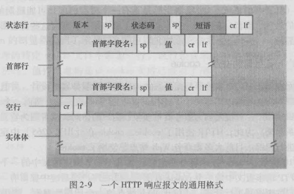
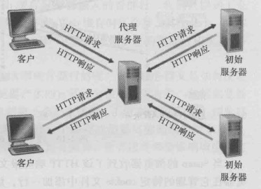
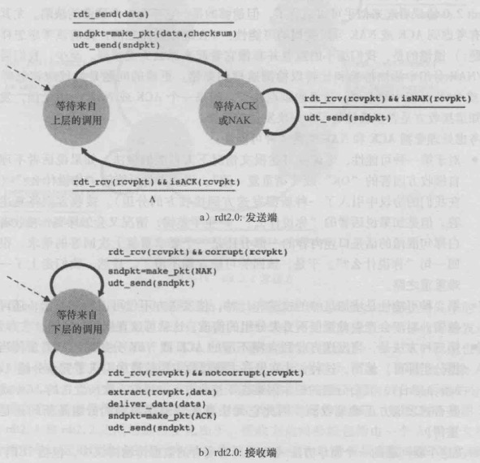
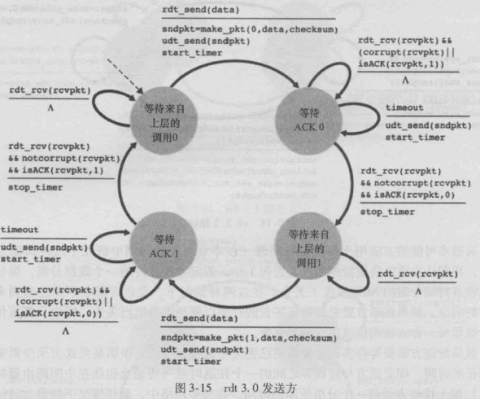
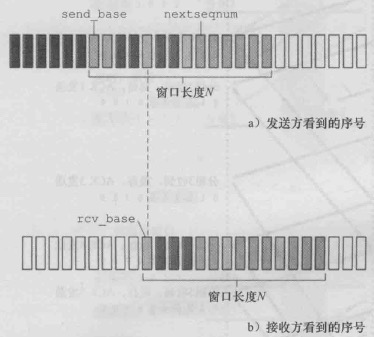

<!-- GFM-TOC -->
* [第一章.计算机网络和因特网](#第一章计算机网络和因特网)
* [第二章.应用层](#第二章应用层)
    * [1.应用程序体系结构](#1应用程序体系结构)
    * [2.因特网提供的运输服务](#2因特网提供的运输服务)
    * [3.应用层协议](#3应用层协议)
        * [3.1 HTTP(超文本传输协议)](#31-http超文本传输协议)
        * [3.2 FTP(文件传输协议)](#32-ftp文件传输协议)
        * [3.3 电子邮件协议](#33-电子邮件协议)
        * [3.4 DNS(域名系统)](#34-dns域名系统)
        * [3.5 P2P应用](#35-p2p应用)
* [第三章.传输层](#第三章传输层)
    * [1.端口号与套接字](#1端口号与套接字)
        * [1.1 端口号](#11-端口号)
        * [1.2 套接字](#12-套接字)
    * [2.多路复用与多路分解](#2多路复用与多路分解)
    * [3.UDP](#3udp)
        * [3.1 UDP报文段结构](#31-udp报文段结构)
    * [4 可靠数据传输原理](#4-可靠数据传输原理)
        * [4.1 完全可靠信道上的可靠数据传输(rdt1.0)](#41-完全可靠信道上的可靠数据传输rdt10)
        * [4.2 具有比特差错信道上的可靠数据传输(rdt2.0、rdt2.1、rdt2.2)](#42-具有比特差错信道上的可靠数据传输rdt20rdt21rdt22)
        * [4.3 具有比特差错的丢包信道上的可靠数据传输(rdt3.0)](#43-具有比特差错的丢包信道上的可靠数据传输rdt30)
        * [4.4 流水线可靠数据传输](#44-流水线可靠数据传输)
    * [5.TCP](#5tcp)
        * [5.1 TCP报文段结构](#51-tcp报文段结构)
        * [5.2 流量控制](#52-流量控制)
        * [5.3 连接管理](#53-连接管理)
        * [5.4 拥塞控制](#54-拥塞控制)
* [第四章.网络层](#第四章网络层)
* [第五章.链路层和局域网](#第五章链路层和局域网)
<!-- GFM-TOC -->

||通信实体|通信结构|
|:--:|:--:|:--:|
|应用层|应用程序|报文(message)|
|运输层|进程|报文段(segment)|
|网络层|主机|数据报|
|链路层||帧|

* **MSS(最大报文段长)**：运输层报文段中“应用层数据”的最大大小，受限于MTU
* **MTU(最大传输单元)**：即最大链路层帧长，链路层所能传输的最大帧大小

# 第一章.计算机网络和因特网

# 第二章.应用层

## 1.应用程序体系结构

1. **客户机/服务器(C/S)体系结构**
2. **P2P体系结构**

## 2.因特网提供的运输服务

当创建一个新的因特网应用时，首先要做出的决定是选择UDP还是TCP，它们能为应用程序提供下列服务：

* **TCP**
    * 面向连接的服务
    * 可靠数据传输服务 
* **UDP**
    *  无连接的服务
    *  不可靠数据传输服务（不保证到达，也不保证有序到达）

除此之外，TCP具有拥塞控制机制，拥塞控制不一定能为应用程序带来直接好处，但能对整个网络带来好处。UDP没有拥塞控制

## 3.应用层协议

### 3.1 HTTP(超文本传输协议)

使用**TCP**作为运输层协议

**无状态协议**：服务器向客户机发送被请求的文件时，并不存储任何关于该客户机的状态信息。假如某个特定的客户机在短短的几秒钟内两次请求同一个对象，服务器并不会因为刚刚为该用户提供了该对象就不再做出反应，而是重新发送该对象

* HTTP客户机：web浏览器
* HTTP服务器：web服务器，包含web对象（HTML文件、JPEG文件、java小程序、视频片段等）

连接类型：

* **非持久连接**：每个请求/响应对是经一个单独的TCP连接发送
* **持久连接**：所有请求/响应对使用同一个TCP连接发送

HTTP默认情况下使用持久连接

如果使用非持久连接，在将TCP握手第三步与一个HTTP请求报文结合起来发送，服务器接收请求后响应一个对象。因此，传输一个对象消耗2个RTT。（可以同时建立多个连接并行传输）但是，由于TCP连接会分配缓冲区和变量，大量使用非持久连接会给服务器造成压力

如果使用持久连接，则客户机接收到请求对象后服务器不会发送一个TCP连接关闭请求。这个连接服务于所有web对象的传输（流水线发送），如果经过一个时间间隔仍为被使用，则HTTP服务器关闭连接

#### 1）HTTP报文格式(请求报文)

“Host”：请求的目标主机  
“Connection:close”：浏览器告诉服务器不希望麻烦地使用持久连接，而是要求服务器在发送完请求后关闭连接  
“User-agent”：用户代理，即向服务器发送请求的浏览器的类型（服务器可以正确地为不同类型的用户代理发送相同对象的不同版本）  
“Accept-language”：用户想得到该对象的语法版本

**方法字段：**

* **GET**：绝大部分HTTP请求报文使用GET方法
* **POST**：用户提交表单时（如向搜索引擎提供关键字），但提交表单不一定要用POST方法
* **HEAD**：类似于GET，区别在于服务器返回的响应报文中不包含请求对象（常用于故障跟踪）
* **PUT**：用于向服务器上传对象
* **DELETE**：用于删除服务器上的对象

#### 2）HTTP报文格式(响应报文)

“Connection:close”：告诉客户机在报文发生完后关闭了TCP连接  
“Date”：报文生成、发生时的日期  
“Last-Modified”：web对象最后修改的日期  

**状态信息：**

* **200 OK**：请求成功，信息包含在返回的响应报文中
* **301 Moved Permanently**：请求的对象已经被永久转移了，新的URL定义在响应报文的Location首部中。客户机软件自动用新的URL获取对象
* **304 Not Modified**：条件GET的响应报文中的状态码，web服务器告诉web缓存响应对象未被修改
* **400 Bad Request**：请求不能被服务器理解
* **404 Not Found**：被请求的文档不在服务器上
* **505 HTTP Version Not Supported**：服务器不支持请求报文使用的HTTP协议版本

>Telnet：HTTP响应报文查看工具

#### 3）cookie

**用于识别用户**，可能出于下列意图：

* 服务器想限制用户的访问
* 服务器想把内容与用户身份关联起来

cookie包含4个组成部分：

1. 在HTTP响应报文中有一个Set-cookie首部行
2. 在HTTP请求报文中有一个Cookie首部行
3. 在用户端系统中保留有一个cookie文件，由用户的浏览器管理
4. 在web站点有一个后端数据库

#### 4）web缓存

web缓存器也叫代理服务器，用于缓存web对象。用户可以配置其浏览器，使得所有HTTP请求首先指向web缓存器

如果web缓存器没有请求的对象，会与初始服务器直接建立一条TCP连接，web缓存器进一步发送HTTP请求，获取对象，当接收到对象后，首先在本地缓存，然后生成一个HTTP响应报文，发送给客户机（**因此，web缓存器既是客户机，又是服务器**）

web缓存器类似于内存与处理器之间的cache，它能从整体上大大降低因特网上的web流量，从而改善所有应用的性能

**条件GET**：web缓存器使用条件GET向web服务器确认某个对象是否已经被修改（不是最新的对象）。如果1)请求报文使用GET方法，2)并且包含一个If-modified-since:首部行，那么这个HTTP请求报文就是一个条件GET

如果相应对象未被修改，web服务器返回一个实体为空的响应报文(也就是说并没有包含请求对象)，状态码为“304 Not Modified”

### 3.2 FTP(文件传输协议)

FTP使用两个并行的TCP连接来传输文件：

1. **控制连接(持久)**：传输控制信息，如用户标识、口令、改变远程目录命令、文件获取上传的命令
2. **数据连接(非持久)**：传输实际文件

FTP客户机发起向FTP服务器的控制连接，然后在该连接上发送用户标识和口令、改变远程目录的命令。FTP服务器收到命令后，发起一个到客户机的数据连接，在该连接上准确地传送一个文件并关闭连接

**有状态的协议**：FTP服务器在整个会话期间保留用户的状态信息。服务器必须把特定的用户账号和控制连接联系起来

### 3.3 电子邮件协议

电子邮件系统有3个主要组成部分：**用户代理、邮件服务器、简单邮件传输协议(SMTP)**

* 每个用户在邮件服务器上有一个邮箱，保存该用户发送和接收的邮件
* 如果邮件未发送成功，会保存在邮件服务器上，通常30分钟左右再进行尝试，几天后仍不成功则删除，并以邮件形式通知发送方
* SMTP传输邮件之前，需要将报文主体编码为ASCII码，传输后需要解码（HTTP传输不需要）
* SMTP一般不使用中间邮件服务器发送邮件，即使两个邮件服务器位于地球的两端
* SMTP会把邮件中所有对象封装在一个报文中，而HTTP则是每个报文封装一个web对象

#### 1）多用途因特网邮件扩展(MIME)

普通的邮件报文主体为ASCII编码的数据，报文首部适合于发生普通的ASCII文本，但是不能充分满足多媒体报文或携带非ASCII文本格式(非英文字符)的报文需求。需要额外的首部行提供对发送这些文件的支持

MIME中包含2支持发送上述文件的首部：

* Content-Transfer-Encoding：指出所用编码类型，接收方可以根据这个字段还原
* Content-Type：文件类型，接收方可以根据这个首部采取一些适当动作（如解压）

#### 2）接收方邮件拉取

SMTP是一个”推协议“，不能用于接收方代理从邮件服务器上拉取邮件，拉取邮件需要使用**POP3(第三版的邮局协议)**、**IMAP(因特网邮件访问协议)**或**HTTP**

**POP3(第三版的邮局协议)**：当用户打开一个到邮件服务器端口110上的TCP连接后，POP3就开始工作了，包含3个阶段

* 特许：用户发送用户名和口令鉴别身份
* 事务处理：用户代理取回报文（还能标记报文、获取邮件统计信息）
* 更新：客户机发出了quit命令后，结束了POP3会话，邮件服务器会删除被标记为删除的报文

使用POP3拉取时，可以设置为”拉取并删除“或”拉取并保留“

**IMAP(因特网邮件访问协议)**：POP3不能提供远程文件夹功能，IMAP可以，IMAP服务器把每个报文与一个文件夹联系起来，IMAP为用户提供了创建文件夹以及在文件夹之间移动邮件的命令。除此之外，还提供在远程文件夹中查询邮件、按指定条件查询匹配文件的命令。与POP3不同，IMAP服务器维护了IMAP会话的用户状态信息

**基于web的电子邮件**：当使用web浏览器发送接收邮件时，推送到邮件服务器和从邮件服务器拉取邮件使用的是HTTP协议

### 3.4 DNS(域名系统)

DNS运行于**UDP**之上，使用**53号端口**，它提供下列服务：

1. **主机名到IP地址的转换(主要)**
2. **主机别名**：有着复杂主机名的主机可以拥有一个或多个别名，应用程序可以调用DNS来获得主机别名对应的规范主机名以及主机的IP地址
3. **邮件服务器别名**：qq.com与foxmail.com，DNS可以解析邮件服务器别名获得规范名和IP地址
4. **负载分配**：繁忙的站点被冗余分布在多台服务器上，这些服务器有不同IP地址，IP地址集合对应于一个规范主机名，当客户机通过主机名获取IP地址时，DNS服务器用包含全部这些地址的报文进行回答，但在每个回答中选择这些地址排放的顺序，从而将负载分配到不同服务器

#### 1）DNS服务器

由于集中设计(单一DNS服务器)具有下列问题：

* 单点故障
* 通信容量：单个DNS服务器承受所有查询负载
* 远距离的集中式数据库：单个DNS服务器不可能”邻近“所有查询客户机

所以DNS服务器使用分布式设计方案：

* **根DNS服务器**：因特网上有13个根DNS服务器(标号A到M)，大部分位于北美洲
* **顶级域(TLD)DNS服务器**
* **权威DNS服务器**

除此之外，DNS服务器还有**本地DNS服务器**。严格来说，本地DNS服务器本部属于DNS服务器的层次结构，但对DNS层次结构很重要。**一台主机具有一台或多台本地DNS服务器的IP地址，本地DNS服务器起着代理的作用，将请求转发到DNS服务器层次结构中**

#### 2）DNS查询步骤

**DNS缓存**：在查询链中，当一个DNS服务器接收到一个DNS回答时，DNS服务器能将回答中的信息缓存在本地存储，以便加速后序可能的相同查询。由于主机IP和主机名之间的映射不是永久的，DNS服务器会在一段时间后丢弃缓存（本地DNS服务器可以缓存TLD服务器的IP地址，因为允许直接绕过查询链中的根DNS服务器）

#### 3）DNS记录和报文

所有DNS服务器共同存储着**资源记录**，资源记录格式如下：

**(Name,Value,Type,TTL)**

* **Type=A**：此时Name是主机名，Value是对应IP地址
* **Type=NS**：Name是域(如foo.com)，Value是知道如何获取该域中主机IP地址的权威DNS服务器的主机名
* **Type=CNAME**：Value是别名为Name的主机对应的规范主机名
* **Type=MX**：Value是别名为Name的邮件服务器的规范主机名

如果一台DNS服务器是某个特定主机名的权威DNS服务器，那么会有一条包含该主机名的类型A记录（不是权威服务器，也可能在缓存中包含A记录）  
如果DNS服务器不是某个主机名的权威DNS服务器，那么会包含一条类型NS记录，还将包含一条类型A记录，提供了在NS记录的Value字段中DNS服务器的IP地址

**DNS报文(查询和响应报文格式相同)**

>nslooup：从主机直接向某些DNS服务器发送DNS查询报文

**注册域名**

因特网名字和地址分配机构(ICANN)向各种注册登记机构授权，可以向这些机构申请注册域名：

1. 提供基本权威DNS服务器和辅助权威服务器的域名和IP
2. 注册登记机构会将NS和A类型的记录输入TLD服务器
3. 确保自身在提供的权威DNS服务器中输入了相应类型的记录

#### 4）DDos带宽洪泛攻击

如，攻击者向每个DNS根服务器连续不断地发送大量的分组，从而使得大多数合法的DNS请求得不到回答

DNS根服务器配置分组过滤器可以拦截这些分组，本地DNS服务器缓存了顶级域名服务器的IP地址，也能绕过DNS根服务器，防止攻击

### 3.5 P2P应用

不同于C/S架构，P2P架构中，每个主机即使客户机也是服务器，称作对等方，由于文件分布存储在多个对等方中，因此文件分发速度更快

**P2P中文件的搜索方式**

* **集中式索引**：使用一个集中式索引服务器存储索引，是一种P2P和C/S混合的体系结构，文件分发是P2P的，搜索是C/S的
* **查询洪泛**：建立在Gnutella协议基础上，索引全面分布在对等方区域中，对等方向相邻对等方发出文件查询请求，相邻对等方进一步转发查询请求
* **层次覆盖**：结合以上两种，与因特网高速连接并具有高可用性的对等方被指派为超级对等方，新的对等方与超级对等方之一建立TCP连接，将其可供共享的所有文件告诉超级对等方，超级对等方维护着一个索引，超级对等方之间通过TCP连接，可以转发查询

# 第三章.传输层

## 1.端口号与套接字

### 1.1 端口号

**通常在一台主机上能够运行许多网络应用程序。IP地址可以标识一台主机，端口号则是用来标识这台主机上的特定进程**

**端口号是一个16bit的数字，大小在0\~65535之间，0\~1023范围的端口号称为周知端口号，保留给周知的应用层协议**

### 1.2 套接字

网络应用由成对进程组成，进程通过一个称为套接字的软件接口在网络上发生和接收报文

**套接字是同一台主机内应用层与运输层之间的接口，也可称为应用程序和网络之间的应用程序编程接口**

#### TCP套接字：(源IP,源端口,目的IP,目的端口)

#### UDP套接字：(目的IP,目的端口)

## 2.多路复用与多路分解

* **多路分解**：将运输层报文段中的数据交付到正确的套接字的过程（通过报文段的端口号字段）
* **多路复用**：从源主机不同套接字收集数据，并为数据封装上首部信息从而生成报文段，传递到网络的过程

## 3.UDP

出于下列原因可能使用UDP：

1. 应用层能更好地控制要发送的数据和发送时间（TCP拥塞时会遏制发送方发送）
2. 无需建立连接
3. 无连接状态（TCP需要维护连接状态，包括接收和发送缓存、拥塞控制参数、序号与确认号的参数）
4. 分组首部开销小（**每个TCP报文段有20字节的首部开销，而UDP仅有8字节的开销**）

可以在应用程序自身中构建可靠性机制来实现UDP应用的可靠数据传输

UDP能提供运输层最低限度的两个服务：**差错检测、数据交付**

### 3.1 UDP报文段结构

UDP首部只有4个字段，每个字段2个字节，一共8个字节大小的首部

**校验和**：前3个首部相加（如有溢出会卷回）的结果取反就是校验和。在接收方，会将前4个首部相加，如果分组无差错，这个和会是“1111-1111-1111-1111”（为了方便阅读，使用'-'分隔）

许多链路层协议提供了差错检测，UDP还需提供校验和的原因在于，不能确保所有链路都提供了差错检测。此外，即使报文段经链路正确地传输，当其存储在某台路由器的内存中时，也可能引入比特差错。既未确保逐段链路的可靠性，也未确保内存中的差错检测，因此UDP必须在端到端基础上在运输层提供差错检测

## 4 可靠数据传输原理

* **rdt**：可靠数据传输
* **udt**：不可靠数据传输

### 4.1 完全可靠信道上的可靠数据传输(rdt1.0)

假设底层信道是完全可靠的

### 4.2 具有比特差错信道上的可靠数据传输(rdt2.0、rdt2.1、rdt2.2)

更现实的底层信道模型是分组中的比特可能受损

引入了**自动重传请求(ARQ)协议**，ARQ还需要另外3种协议来处理存在的比特差错：

1. **差错检测**
2. **接收方反馈**：肯定确认(ACK)和否定确认(NAK)
3. **重传**：接收方收到有差错的分组时，发送方重传

对于发送方，在等待ACK或NAK状态时，不能发送更多分组。类似于rdt2.0这种行为的协议被称为**停等协议**

**rdt2.0的问题在于没有考虑到ACK和NAK分组可能受损的情况**

处理受损ACK或NAK的办法是，如果收到受损的ACK或NAK，则重传一次分组，但是这样又无法确认是一次新的分组还是重传的分组。解决办法是在分组中添加一个序号字段，接收方只需检查序号即可确定收到的分组是否是一次重传。对于rdt2.0，只需1比特序号即可，从而得到rdt2.1

如果收到受损的分组，接收方也可以发送一个对上次正确接收分组的ACK，也能实现与NAK一样的效果，也就是rdt2.2

### 4.3 具有比特差错的丢包信道上的可靠数据传输(rdt3.0)

现在假定除了比特受损外，底层信道还会丢包，因此需要引入时间机制决定何时重传分组

### 4.4 流水线可靠数据传输

rdt3.0功能正确，但由于是一个停等协议，所以性能很差。如果能在收到确认之前发送多个分组，可以大大提升性能

#### 1）回退N步(GBN)

也被称为滑动窗口协议

 * **发送方**
     - 超时重传所有已发送但未确认的分组
 * **接收方**
     - 每接收到一个有序分组交付到上层，丢弃无序分组
     - 累积确认收到的有序分组

**丢弃无序分组的优点在于接收方缓存简单，需要维护的唯一信息就是下一个按序接收的分组的序号；缺点是对于丢弃的分组，随后重传也许会丢失或出错，因此甚至需要更多的重传**

下图为窗口长度为4个分组的GBN运行情况：

#### 2）选择重传(SR)

一个单个分组的差错就可能引起GBN重传大量分组，许多分组根本没有必要重传。随着信道差错率的增加，流水线可能被这些没有必要重传的分组填满

* **发送方**
    - 如果收到的ACK对应一个窗口内的分组，则标记为已接收，序号等于send_base则移动窗口至具有最小序号的未确认分组处
    - 如果窗口移动了，并且有序号落在窗口内的未发生分组，则发送这些分组
* **接收方**
    - 确认(ACK)一个正确接收到的分组（收到滑动窗口前的分组也要再次确认，因为这种情况通常意味着这个分组的前一次确认未被发送方收到）
    - 失序分组会被缓存直到所有丢失分组都被收到，此时将一批分组按序交付给上层

一个SR运行的例子：

>对于SR而言，接收方窗口长度必须小于等于序号空间大小的一半，否则可能无法确认一个分组是重传还是初次传送

## 5.TCP

TCP是面向连接的，提供全双工的服务：数据流可以双向传输。也是点对点的，即在单个发送方与单个接收方之间的连接

### 5.1 TCP报文段结构

* **序号**：TCP的序号是数据流中的字节数，不是分组的序号。表示该报文段数据字段首字节的序号
* **确认号**：TCP使用累积确认，确认号是第一个未收到的字节序号，表示希望接收到的下一个字节
* **首部长度**：**通常选项字段为空，所以一般TCP首部的长度是20字节**
* (可选与变长的)**选项字段**：用于发送方与接收方协商MSS(最大报文段长)，或在高速网络环境下用作窗口调节因子
* **标志字段**
    - **ACK**：指示确认字段中的值是有效的
    - **RST,SYN,FIN**：连接建立与拆除
    - **PSH**：指示接收方应立即将数据交给上层
    - **URG**：报文段中存在着(被发送方的上层实体置位)“紧急”的数据
* **接收窗口**：用于流量控制（表示接收方还有多少可用的缓存空间）

TCP RFC并没有规定失序到达的分组应该如何处理，而是交给程序员。可以选择丢弃或保留

如果发生超时，TCP只重传第一个已发送而未确认的分组，超时时间间隔会设置为原来的2倍

### 5.2 流量控制

如果应用程序读取数据相当慢，而发送方发送数据太多、太快，会很容易使接收方的接收缓存溢出，流量控制就是用来进行发送速度和接收速度的匹配。发送方维护一个“接收窗口”变量，这个变量表示接收方当前可用的缓存空间

* LastByteRead:接收方应用程序从接收缓存中读取的最后一个字节
* LastByteRcvd:接收方接收到的最后一个字节

要防止缓存溢出，则应该满足如下条件：

LastByteRecv - LastByteRead <= RcvBuffer

接收方可通过下列公式计算RcvWindow:

RcvWindow = RcvBuffer - [LastByteRecv - LastByteRead]

然后将RcvWindow的值记录在TCP报文段中，发送给发送方。发送方轮流跟踪两个变量LastByteSent和LastByteAcked，这两个变量只差就是发送到连接中但未被确认的数据量。通过将其控制在RcvWindow内，就能实现流量控制:

LastByteSent - LastByteAcked <= RcvWindow

这个方案存在一个问题，当接收方缓存已满时，将RcvWindow=0通告给发送方，并且接收方没有任何数据要发送给发送方，随着接收方应用进程清空缓存，TCP并不向发送方发送带有RcvWindow新值的新报文段；TCP仅在它有数据或确认要发送时才会发送报文段。这样，发送方不会知道接收方缓存已经有新的空间，发送方因此被阻塞而不能再发送数据。为解决这个问题，TCP规约中要求：当接收方的接收窗口为0时，发送方继续发送只有1个字节数据的报文段。这些报文段将会被接收方确认。最终缓存将开始清空，并且确认报文里将包含一个非0的RcvWindow值

### 5.3 连接管理

#### 3次握手

1. **客户端向服务器发送SYN报文段**（不包含应用层数据，首部的一个标志位(即SYN比特)被置位，客户端随机化选择(避免攻击)一个起始序号x）
2. 服务器为该TCP连接分配TCP缓存和变量，**返回一个SYNACK报文段**（也不包含应用层数据，SYN比特被置为1，ACK为x+1，服务器选择自己的初始序列y）
3. 客户机为该连接分配缓存和变量，**返回一个对SYNACK报文段进行确认的报文段**（因为连接已经建立了，所以SYN比特被置为0）

**如果客户端不发送ACK来完成第三次握手，最终(通常是一分钟后)服务器将终止该半开连接并回收已分配的资源（在第三次握手前分配缓存和变量，可能会受到SYN洪泛攻击）**

**前两次“握手”不包含有效载荷，第三次“握手”可以承载有效载荷**

> 需要3次握手的原因在于信道不可靠，如果信道可靠一方都能确保另外一方收到数据；
> * 为什么不是2次握手？如果只用2次握手，服务器收到客户端的请求后，因为服务器并不需要等待客户端的确认(第3次握手)，所以一个连接已经建立。1）在第2次握手时，如果报文段丢失，超时会引起客户端重新发起连接请求，此时服务器会认为这是客户端建立的另一个连接，因此又建立起一个连接，从而造成服务器为同一客户端维护了大量连接资源，造成浪费；2）如果客户端第一次握手超时，但是这个报文段并未丢失，直到一次正常的通信结束后才到达服务器。由于一次正常的通信后连接已经关闭，但是服务器认为这是客户端一次新的连接请求，因此建立起一个连接，但是客户端并不会对此进行响应，也造成了资源浪费；
> * 为什么不是4次握手？

#### 4次挥手

TCP连接的两个进程中任意一个都能终止该连接，连接关闭需要4步。假设客户端发起一个关闭请求：

1. **客户端发送一个FIN报文**（首部中的FIN比特被置位）
2. **服务器返回一个对FIN报文的确认报文**
3. **服务器发送一个FIN报文**（首部中的FIN比特被置位）
4. **客户端返回一个对FIN报文的确认报文**

>SYN洪泛攻击：攻击者发送大量的TCP SYN报文段，而不完成三次握手的第三步。通过从多个源发送SYN能够加大攻击力度，产生DDos(分布式拒绝服务) SYN洪泛攻击
预防：SYN cookies

>nmap：可以“侦察”打开的TCP接口、UDP接口；还能“侦察”防火墙及其配置；甚至能“侦察”应用程序及操作系统版本

### 5.4 拥塞控制

拥塞控制分类：

* 端到端拥塞控制：网络层没有为运输层拥塞控制提供显示支持（TCP的拥塞控制）
* 网络辅助的拥塞控制：网络层组件向发送方提供关于网络中拥塞状态的显式反馈信息（ATM ABR）
    - 直接反馈：路由器通过阻塞分组直接通知发送方拥塞
    - 路由器标记或更新从发送方流向接收方的分组中的某个字段来指示拥塞，接收方收到后通知发送方

#### TCP拥塞控制

由于IP层不向端系统提供显示的网络拥塞反馈，所以TCP必须使用端到端拥塞控制，而不是网络辅助拥塞控制

**TCP连接的两方都记录一个额外的变量：拥塞窗口(CongWin)**，它对一个TCP发送方能向网络中发送流量的速率进行了限制。特别是，在一个发送方中未被确认的数据量不会超过CongWin与RcvWindow中的最小值:

LastByteSent - LastByteAcked <= min{CongWin,RcvWindow}

>后面的分析假设TCP接收缓存足够大，因此不受RcvWindow的限制，从而可以只关注拥塞窗口

**两个拥塞指示**：

* **3次冗余ACK**(第一次冗余是第二次收到相同ACK时，所以一共4次)
* **超时**

**TCP拥塞控制算法的三个主要部分**

1. **加性增、乘性减**
    * 加性增：缓慢增加CongWin，每个RTT增加1个MSS，线性增长（拥塞避免）
    * 乘性减：发生丢包是，设置CongWin = CongWin/2（不低于1个MSS），从而控制发送速度 
2. **慢启动**：TCP连接开始时，CongWin的初始值为1个MSS，指数型增长
3. **对拥塞指示作出反应**
    * 3次冗余ACK：CongWin = CongWin/2，然后线性增加（拥塞避免）
    * 超时：CongWin被设置为1个MSS，然后指数增长，直到CongWin达到超时前的一半为止

**Threshold(阈值)**：用于确定慢启动将结束并且拥塞避免将开始的窗口长度，初始化为一个很大的值，每当发送一个丢包时，会被设置为丢包时CongWin的一半

# 第四章.网络层

# 第五章.链路层和局域网
